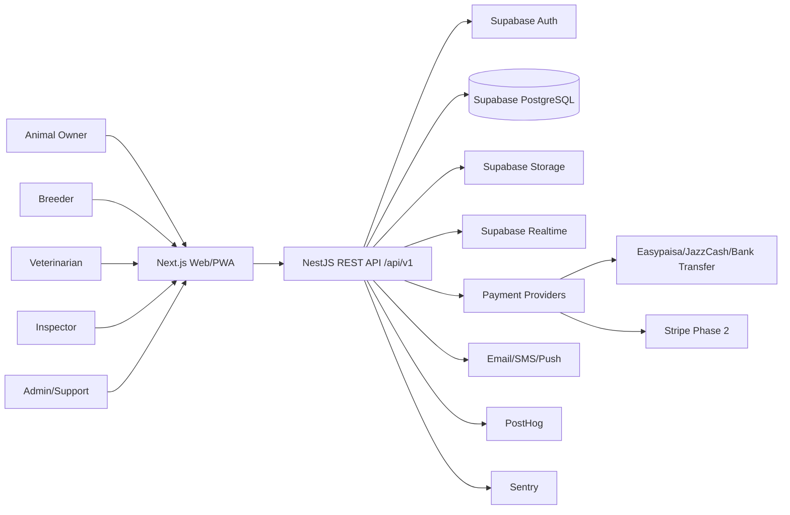

# Context.md

## Business Overview

The platform is a managed marketplace for animal mating and breeding services. It connects animal owners, breeders, veterinarians, inspectors, and support teams around verified animal profiles, breeding requests, scheduling, payments, records, and post-breeding documentation.

The initial wedge is Pakistan livestock and companion-animal breeding, with a later expansion into the United States where expectations for compliance, breeder screening, contracts, payment protection, and consumer disclosures are higher.

## Strategic Positioning

Most existing platforms behave like classifieds: they help users post animals and exchange contact details. This platform should instead become the trusted transaction and records layer for breeding.

### Core Differentiators

- Verified animal profiles with ownership, health, vaccination, media, and pedigree evidence.
- Structured breeding request workflow instead of informal calls and WhatsApp negotiation.
- Veterinarian and inspector participation.
- Escrow-capable payments and dispute handling.
- Breed, region, and compliance-aware recommendations.
- Breeding history that compounds into defensible data.

## Assumptions

1. Pakistan users will heavily prefer phone login, Urdu/English UI, WhatsApp-like communication, Easypaisa, JazzCash, and bank transfer.
2. Rural adoption requires lightweight mobile web/PWA before a native app.
3. Initial traction is easier through high-intent niches:
   - Dairy cattle and buffalo breeding in Punjab and Sindh.
   - Goat and sheep breeders around seasonal and commercial demand.
   - Pedigreed dogs in major cities.
   - Horse breeders as a premium but smaller vertical.
4. USA launch will require stronger state-by-state compliance, breeder licensing capture, contracts, health guarantees, and dispute handling.
5. Artificial insemination and semen sales must be handled carefully because Pakistan provinces regulate livestock breeding services, semen production/distribution, and AI technicians.
6. The MVP does not need to physically transport animals. It should support scheduling, location coordination, and provider referrals.

## Target Users

| Role | Primary Need | MVP Priority |
| --- | --- | --- |
| Animal Owner | Find quality breeding partner and maintain records | High |
| Breeder | List animals, manage inquiries, monetize reputation | High |
| Veterinarian | Verify health, upload certificates, support breeding readiness | Medium |
| Inspector | Verify animal, location, pedigree, or breeder claims | Medium |
| Buyer | Discover future offspring or breeding programs | Low for MVP |
| Support Agent | Resolve disputes and trust issues | High |
| Super Admin | Manage platform, regions, compliance, revenue, abuse | High |

## Product Phases

### Phase 1: Pakistan MVP

- Phone/email authentication.
- Animal profile management.
- Basic verification.
- Marketplace search and filters.
- Breeding request workflow.
- In-app chat and notifications.
- Manual or semi-automated Pakistan payment methods.
- Admin dashboard.
- Audit logs and analytics events.

### Phase 2: Pakistan Growth

- Escrow automation where provider support allows it.
- Boosted listings.
- Subscription plans.
- Veterinarian network.
- Inspector workflows.
- Recommendation scoring.
- Referral programs.
- Full-text search optimization.

### Phase 3: USA Expansion

- Stripe payments.
- State-specific compliance rules.
- Breeder license and USDA APHIS fields.
- Puppy/pet purchaser disclosure templates.
- Contracts, deposits, refunds, and health guarantee workflows.
- Enhanced identity verification.

### Phase 4: Scale

- Queue workers.
- Redis.
- Elasticsearch/OpenSearch.
- Service extraction.
- Multi-region deployment.

## Architecture Decision

Use a modular monolith for MVP.

### Why

- Faster launch with fewer operational dependencies.
- Shared transaction boundary for breeding requests, payments, and records.
- Easier audit logging.
- Simpler debugging and deployment.
- Natural extraction path once domains prove scale pressure.

### Trade-Offs

| Choice | Benefit | Cost | Decision |
| --- | --- | --- | --- |
| Modular monolith | Fast and low cost | Needs module discipline | Use for MVP |
| Microservices | Independent scaling | Operational overhead | Defer |
| Supabase Auth | Fast auth launch | Provider coupling | Use with abstraction |
| PostgreSQL search | Cheap and simple | Less ranking flexibility | Use for MVP |
| Elasticsearch | Better search | More ops cost | Phase 2 |
| Vercel deployment | Fast CI/CD | Serverless constraints | Use initially |

## High-Level System Diagram

## Bounded Contexts

| Context | Responsibility |
| --- | --- |
| Identity | Auth provider linkage, sessions, OTP, social login, account status |
| Users | Profiles, roles, addresses, locale, notification preferences |
| Animals | Animal profiles, breed, species, sex, age, status, media |
| Health | Vaccinations, veterinary checks, disease declarations, certificates |
| Pedigree | Parent links, registry numbers, lineage, DNA/test documents |
| Matching | Search, filters, compatibility scoring, distance calculations |
| Breeding Requests | Request lifecycle, schedule, completion, records |
| Marketplace | Listings, boosts, featured profiles, availability windows |
| Payments | Provider integrations, checkout, escrow, refunds |
| Ledger | Immutable platform financial records |
| Verification | KYC/KYB, animal verification, vet/inspector approvals |
| Messaging | Conversations, messages, attachments, moderation |
| Notifications | Email, SMS, push, templates, delivery logs |
| Reviews | Ratings, breeder feedback, dispute-influenced reputation |
| Analytics | Event ingestion, funnels, revenue, growth dashboards |
| Admin | Moderation, configuration, support tools |
| Audit | Immutable records of critical actions |

## Internationalization and Regionalization

The platform must avoid hardcoding Pakistan-only behavior.

Use region configuration for:

- Country.
- Currency.
- Payment methods.
- Tax labels.
- Supported languages.
- Breed registry integrations.
- Compliance checklists.
- Phone formats.
- Distance units.
- Consumer protection rules.

Initial regions:

| Region | Currency | Languages | Payment Methods |
| --- | --- | --- | --- |
| Pakistan | PKR | English, Urdu | Easypaisa, JazzCash, bank transfer |
| United States | USD | English, Spanish later | Stripe card, ACH later |

## MVP Success Metrics

- Verified supply: number of verified breeders and animals.
- Marketplace liquidity: search-to-request conversion.
- Trust: percentage of requests with health/pedigree evidence.
- Transaction safety: dispute rate and resolution time.
- Monetization: paid boosts, subscriptions, commissions, and escrow volume.
- Retention: breeding records created per active animal.

## Checkpoint

This document defines the business context, phasing, and architecture constraints. Engineers should not start feature implementation until they have also read `Features.md`, `Rule.md`, and `IntegrationGuide.md`.

