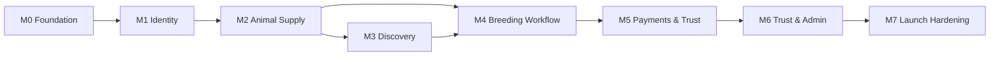
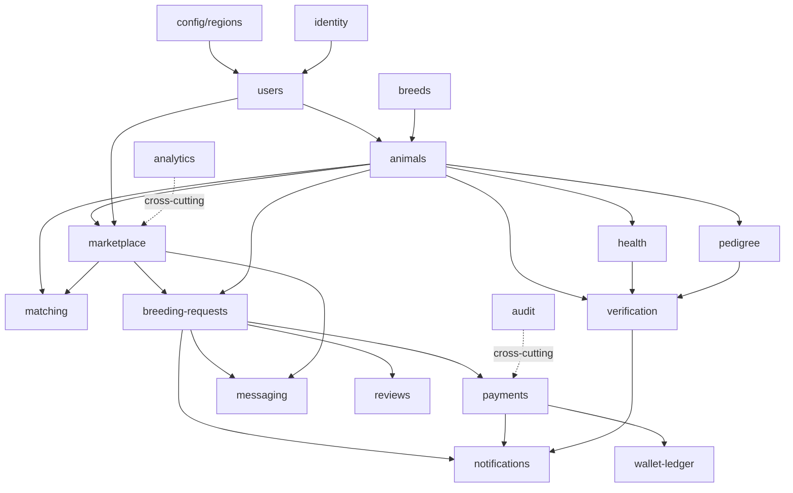

# DeliveryPlan.md

> **DEPRECATED.** This document is superseded by [`doc/ImplementationPlan.md`](ImplementationPlan.md), which is the authoritative engineering-execution source of truth, and operationalized in [`doc/ExecutionBacklog.md`](ExecutionBacklog.md). Do not update this file; make changes in `ImplementationPlan.md` instead.

## Purpose

This is the consolidated execution blueprint for the Pakistan-first verified breeding marketplace. It reconciles the `Agent.md` delivery checkpoints, the `MarketPlan.md` 90-day roadmap, and the `MarketPlan.md` sprint plan into one authoritative plan, and adds the module breakdown, dependency graph, delivery risks, authoritative folder structure, and complexity estimates needed to schedule and staff the build.

It complements the existing documents:

- `MarketPlan.md` owns business strategy and the _business_ risk register.
- `Context.md` and `IntegrationGuide.md` own architecture and schema.
- This file owns the _engineering execution_ view: what gets built, in what order, by whom, with what effort and delivery risk.

If milestones, modules, dependencies, or estimates change, update this file in the same change.

## Milestones

Milestones reconcile `Agent.md` checkpoints (Checkpoint 1-5), the 90-day roadmap, and the sprint plan. Each milestone has explicit entry and exit criteria. Days are indicative for a lean team (see `MarketPlan.md` team structure).

| Milestone              | Maps To                 | Window     | Exit Criteria                                                                                                                                                                 |
| ---------------------- | ----------------------- | ---------- | ----------------------------------------------------------------------------------------------------------------------------------------------------------------------------- |
| M0 Foundation          | Sprint 0                | Days 1-15  | Monorepo, CI, Supabase connected, foundation migration, design-system shell, admin shell. App boots locally.                                                                  |
| M1 Identity & Profiles | Checkpoint 1 / Sprint 1 | Days 8-20  | Email + phone-OTP auth, roles, profile completion, admin can view users. RLS baseline live.                                                                                   |
| M2 Animal Supply       | Checkpoint 2 / Sprint 2 | Days 16-35 | Animal CRUD, media upload (signed URLs), health + pedigree records, breeder profiles, listing drafts. Verification badges visible, default unverified.                        |
| M3 Discovery           | Sprint 3                | Days 31-50 | Listing publish, full-text search + filters, listing detail, SEO city/species pages, saved listings, analytics events.                                                        |
| M4 Breeding Workflow   | Checkpoint 3 / Sprint 4 | Days 46-65 | Request lifecycle (requested→accepted→scheduled→completed→record→closed + dispute/cancel), breeding record generation, messaging, notifications.                              |
| M5 Payments & Trust    | Checkpoint 4 / Sprint 5 | Days 61-78 | Payment intents, bank-transfer proof, Easypaisa/JazzCash adapters or stubs, immutable ledger, protected-payment states, verification queue, admin reconciliation, audit logs. |
| M6 Trust & Admin       | Sprint 6                | Days 70-85 | Vet/inspector workflows, disputes with reason codes, reviews/reputation, content moderation, audit explorer.                                                                  |
| M7 Launch Hardening    | Checkpoint 5 / Sprint 7 | Days 76-90 | QA + RBAC/state-transition tests, security review, performance checks, observability, restore + webhook-replay tests, seed supply, beta instrumentation.                      |



## Module Breakdown

Modules follow the domain-driven modular monolith in `Claude.md`. Each NestJS module follows the structure in `IntegrationGuide.md` (controller, service, repository, dto, entities, policies, events, module).

> Naming note: the liveness/readiness endpoint module is `system` (a.k.a. health-check). The animal clinical-records module is `health`. These are distinct; do not conflate them.

| Module            | Scope                                                                            | Owned Tables                                                                   | Key Endpoints                                          | Owning Agent                |
| ----------------- | -------------------------------------------------------------------------------- | ------------------------------------------------------------------------------ | ------------------------------------------------------ | --------------------------- |
| system            | Liveness/readiness, build info                                                   | none                                                                           | `GET /api/v1/health`                                   | DevOps/Backend              |
| config/regions    | Region, currency, locale, compliance config                                      | `regions`                                                                      | (admin region config)                                  | Backend/Compliance          |
| identity          | Auth provider linkage, sessions, OTP, account status                             | (Supabase `auth.users`)                                                        | `POST /auth/profile`                                   | Backend                     |
| users             | Profiles, roles, locale, notification prefs, consents                            | `profiles`, `user_roles`, `notification_preferences`, `consents`               | `GET/PATCH /me`, `GET/PATCH /admin/users`              | Backend                     |
| breeds            | Species/breed taxonomy, seed data                                                | `breeds`                                                                       | (admin breed taxonomy)                                 | Backend                     |
| animals           | Animal profiles, media                                                           | `animals`, `animal_media`                                                      | `/animals*`, media upload-url                          | Backend                     |
| health            | Clinical records, vaccination, fertility, readiness                              | `health_records`                                                               | `/animals/:id/health-records`                          | Backend                     |
| pedigree          | Lineage, registry, DNA documents                                                 | `pedigree_records`                                                             | `/animals/:id/pedigree`                                | Backend                     |
| matching          | Search, filters, deterministic compatibility scoring, distance                   | (reads `listings`/`animals`)                                                   | `GET /listings` (search)                               | Backend                     |
| marketplace       | Listings, boosts, featured, availability, saved listings                         | `listings`, `boost_orders`, `saved_listings`                                   | `/listings*`, `/listings/:id/boost`, `/saved-listings` | Backend                     |
| breeding-requests | Request lifecycle, schedule, completion, records, disputes                       | `breeding_requests`, `breeding_request_events`, `breeding_records`, `disputes` | `/breeding-requests*`                                  | Backend                     |
| payments          | Provider integrations, intents, webhooks, refunds, subscriptions, boost purchase | `payment_intents`, `subscription_plans`, `subscriptions`                       | `/payments*`, `/subscriptions*`                        | Backend (specialist review) |
| wallet-ledger     | Immutable financial records, payouts                                             | `ledger_entries`, `payouts`, `payout_accounts`                                 | `/admin/payments/*`, `/payouts*`                       | Backend (specialist review) |
| verification      | KYC/KYB, animal/health/pedigree/facility verification                            | `verification_requests`                                                        | `/verifications*`, `/admin/verifications/*`            | Backend/Compliance          |
| messaging         | Conversations, messages, attachments, moderation                                 | `conversations`, `conversation_participants`, `messages`                       | `/conversations*`, `/messages/:id/report`              | Backend                     |
| notifications     | Email/SMS/push templates, device tokens, delivery logs                           | `devices`, `notification_logs`                                                 | `/devices*`                                            | Backend                     |
| reviews           | Ratings, reputation, dispute-weighted feedback                                   | `reviews`                                                                      | `/reviews*`                                            | Backend                     |
| analytics         | Event ingestion, funnels, dashboards                                             | `analytics_events`                                                             | (event capture + dashboards)                           | Backend/Product             |
| admin             | Moderation, configuration, support tooling                                       | (cross-module)                                                                 | `/admin/*`                                             | Backend/Product             |
| audit             | Immutable record of critical actions                                             | `audit_logs`                                                                   | (admin audit explorer)                                 | Backend                     |

## Dependencies

### Internal Build Order



Cross-cutting modules (`audit`, `analytics`, `notifications`) are consumed by many modules via domain events; build their core early and wire emitters as each producing module lands.

### External & Critical-Path Dependencies

| Dependency                                  | Blocks                         | Lead-Time Risk                | Mitigation                                                                                     |
| ------------------------------------------- | ------------------------------ | ----------------------------- | ---------------------------------------------------------------------------------------------- |
| Easypaisa/JazzCash merchant approval        | M5 live payments               | High (third-party onboarding) | Build behind `PaymentProvider` interface; ship bank-transfer + stubs first.                    |
| Pakistan SMS deliverability                 | M1 phone OTP, M4 notifications | Medium                        | Validate against live networks early; fall back to Supabase phone auth / alternate aggregator. |
| Supabase project + tiers                    | M0 onward                      | Low                           | Provision in M0; confirm PITR plan before M7.                                                  |
| Vercel (or alt API host) decision           | M0/M5                          | Medium                        | Resolve serverless-vs-long-running API host (see Risks) before payment webhooks.               |
| Legal review of protected-payment structure | M5/M6                          | High                          | Do not claim regulated escrow; ledger-state model until cleared.                               |
| Vet/inspector recruitment                   | M6                             | Medium                        | Manual onboarding; workflows usable with few participants.                                     |

## Risks (Delivery / Technical)

This register covers execution and technical risk. Business/market risk lives in `MarketPlan.md`.

| Risk                                                                     | Likelihood | Impact | Mitigation                                                                                                       |
| ------------------------------------------------------------------------ | ---------- | ------ | ---------------------------------------------------------------------------------------------------------------- |
| NestJS on Vercel serverless (cold starts, exec limits, webhook handling) | Medium     | High   | Decide API host early; prefer long-running host (Railway/Render/Fly) for the API if serverless constraints bite. |
| No queue in MVP undermines webhook/notification reliability              | Medium     | High   | Transactional outbox table + cron drain; introduce real queue in Phase 4.                                        |
| Payment provider behavior unknown (split/hold support)                   | High       | High   | Provider interface + manual reconciliation + idempotency keys; validate capabilities before promising holds.     |
| `search_vector` not auto-populated                                       | Medium     | Medium | Add trigger to maintain tsvector on insert/update (specified in `IntegrationGuide.md`).                          |
| Ledger/audit mutated by app bug                                          | Low        | High   | Enforce append-only via DB grants (revoke UPDATE/DELETE), not convention.                                        |
| Scope creep from deferred features pulled into MVP                       | Medium     | Medium | Honor the `Features.md` Defer list; route additions through this plan.                                           |
| Cross-cutting events (audit/analytics/notifications) bolted on late      | Medium     | Medium | Stand up emitters in M1-M2; treat missing audit events as test failures.                                         |
| RLS/RBAC drift between layers                                            | Medium     | High   | State-transition + ownership tests required per `Agent.md`; specialist review for high-risk modules.             |
| Urdu RTL layout retrofitted late                                         | Medium     | Medium | Bake RTL + i18n keys into the design system in M0.                                                               |

## Folder Structure (Authoritative)

This corrects the drift in earlier docs. Product/architecture markdown lives in `doc/`; agent-governing rules and context live in `.cursor/`.

```text
.
├── apps/
│   ├── web/                     # Next.js App Router frontend
│   │   ├── app/
│   │   ├── components/
│   │   ├── features/
│   │   ├── lib/
│   │   ├── messages/            # en.json, ur.json (RTL-aware)
│   │   └── public/
│   └── api/                     # NestJS REST API (/api/v1)
│       ├── src/
│       │   ├── main.ts
│       │   ├── app.module.ts
│       │   ├── common/
│       │   ├── config/
│       │   ├── modules/         # system, identity, users, animals, ...
│       │   └── openapi/
│       └── test/
├── packages/
│   ├── config/                  # Zod-validated env config (web + api)
│   ├── database/                # Generated Supabase types, DB tooling refs
│   ├── shared/                  # Types, constants, provider interfaces
│   └── ui/                      # Shared React primitives
├── supabase/                    # SOURCE OF TRUTH for schema
│   ├── migrations/
│   ├── policies/
│   └── seed.sql
├── docker/                      # Docker Compose + Dockerfiles
├── .github/
│   └── workflows/               # CI/CD
├── doc/                         # Product, market, architecture blueprint
│   ├── Agent.md
│   ├── Claude.md
│   ├── DeliveryPlan.md          # this file
│   ├── Features.md
│   ├── Integration.md
│   ├── IntegrationGuide.md
│   ├── MarketPlan.md
│   ├── Pricing.md
│   ├── Setup.md
│   └── Skill.md
└── .cursor/                     # Agent-governing docs
    ├── Context.md
    └── Rule.md
```

> Migration source of truth: `supabase/migrations/`. `packages/database/` holds generated types and references only; it must not contain a divergent second copy of schema migrations.

## Estimated Complexity

T-shirt sizing per module: S (~2-3 dev-days), M (~4-7), L (~8-12), XL (~13+). "Risk" reflects compliance/financial sensitivity and need for specialist review (see `Skill.md`).

| Module            | Size | Risk   | Notes                                                               |
| ----------------- | ---- | ------ | ------------------------------------------------------------------- |
| system            | S    | Low    | Liveness/readiness only.                                            |
| config/regions    | S    | Low    | Seed PK/US; jsonb compliance config.                                |
| identity          | M    | Medium | Phone OTP + deliverability validation.                              |
| users             | M    | Medium | Roles, prefs, consents, RLS.                                        |
| breeds            | S    | Low    | Taxonomy + seed.                                                    |
| animals           | L    | Medium | CRUD + media + signed URLs + soft delete.                           |
| health            | M    | Medium | Private records, signed URLs.                                       |
| pedigree          | M    | Medium | Lineage + registry + documents.                                     |
| matching          | M    | Low    | Deterministic scoring + distance + full-text search.                |
| marketplace       | L    | Medium | Listings, publish, boosts, saved listings, SEO surface.             |
| breeding-requests | XL   | High   | State machine, events, records, disputes — core domain.             |
| payments          | XL   | High   | Providers, webhooks, idempotency, subscriptions; specialist review. |
| wallet-ledger     | L    | High   | Immutable ledger, payouts; specialist review.                       |
| verification      | L    | High   | KYC/KYB + animal/health/pedigree/facility; compliance review.       |
| messaging         | L    | Medium | Realtime chat, attachments, moderation, phone-masking.              |
| notifications     | M    | Medium | Multi-channel templates (localized), device tokens, delivery logs.  |
| reviews           | M    | Medium | Reputation rules, dispute weighting.                                |
| analytics         | M    | Low    | Event capture + dashboards; privacy filters.                        |
| admin             | L    | Medium | Cross-module moderation + config + reconciliation UI.               |
| audit             | M    | High   | Append-only enforcement; coverage of privileged actions.            |

Indicative rollup for the lean MVP team: the critical path is `breeding-requests` + `payments` + `wallet-ledger` + `verification` (all High risk), which should receive the most senior backend time and specialist review.

## Checkpoint

This plan is the engineering execution source of truth. Before starting a milestone, confirm its entry criteria are met, the upstream modules in the dependency graph are merged, and any High-risk module on the path has specialist review scheduled per `Skill.md`. Update milestones, module ownership, dependencies, and estimates here whenever scope or sequencing changes.
