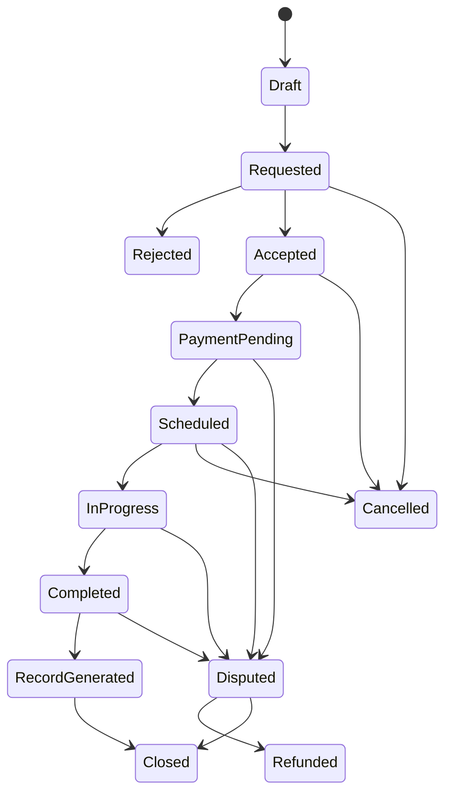

# Features.md

## Product Scope

The platform is a verified breeding marketplace. It must support animal registration, discovery, matching, breeding requests, scheduling, records, payments, communication, verification, and analytics.

## User Roles

### Super Admin

Capabilities:

- Manage all users, animals, listings, payments, disputes, regions, breeds, and settings.
- Assign roles.
- Approve or reject verification.
- Suspend accounts and listings.
- View audit logs and analytics.
- Configure commissions, subscriptions, boosts, and compliance rules.

### Breeder

Capabilities:

- Create breeder profile.
- Register animals.
- List animals for breeding.
- Set breeding fee, availability, location radius, and requirements.
- Accept or reject mating requests.
- Upload health and pedigree documents.
- Receive payments or payouts.
- Manage reviews and inquiries.

### Animal Owner

Capabilities:

- Register animals.
- Search for compatible breeding partners.
- Submit mating requests.
- Pay deposit or full fee.
- Upload animal health records.
- Communicate with breeders.
- Generate and store breeding records.

### Veterinarian

Capabilities:

- Maintain professional profile and license information.
- Verify health checks.
- Upload vaccination or fertility documents.
- Mark animal breeding readiness.
- Participate in request records when invited.

### Inspector

Capabilities:

- Verify animal identity, location, media, pedigree evidence, and breeder facility claims.
- Submit inspection reports.
- Recommend verification status.

### Buyer

Capabilities:

- Discover breeders and expected litters or offspring.
- Join waitlists in future phases.
- View verified breeding program signals.

### Support Agent

Capabilities:

- View support queue.
- Moderate messages and listings.
- Manage disputes.
- Trigger refunds according to policy.
- Escalate fraud and welfare concerns.

### Field Onboarding Representative

Field reps support assisted onboarding for low-digital-literacy supply (see `MarketPlan.md` go-to-market).

Capabilities:

- Create or assist animal/breeder profiles on behalf of an owner with consent.
- Capture media and documents during field visits.
- Submit profiles into the verification queue.
- Cannot manage payments, payouts, or disputes.

This role can be implemented as a scoped variant of Support for MVP; track field-created records for attribution and audit.

## RBAC Matrix

| Feature | Admin | Support | Breeder | Owner | Vet | Inspector | Buyer |
| --- | --- | --- | --- | --- | --- | --- | --- |
| Create animal | Yes | No | Yes | Yes | No | No | No |
| Edit owned animal | Yes | No | Yes | Yes | No | No | No |
| Verify animal | Yes | No | No | No | Health only | Evidence only | No |
| Search listings | Yes | Yes | Yes | Yes | Yes | Yes | Yes |
| Create breeding request | Yes | No | Yes | Yes | No | No | No |
| Accept request | Yes | No | Yes if recipient | Yes if recipient | No | No | No |
| Manage payments | Yes | Limited | Own payouts | Own payments | No | No | No |
| Moderate content | Yes | Yes | No | No | No | No | No |
| Save listing | Yes | Yes | Yes | Yes | Yes | Yes | Yes |
| Leave review | Yes | No | Yes if participant | Yes if participant | No | No | No |
| Manage disputes | Yes | Yes | Own only | Own only | No | No | No |
| View audit logs | Yes | Limited | No | No | No | No | No |

## Authentication

### MVP

- Email/password.
- Phone OTP.
- Social login as optional.
- JWT sessions.
- Account recovery.
- Device and session tracking.

### Acceptance Criteria

- A user can sign up with phone OTP in Pakistan format.
- A user can add email after phone signup.
- Suspended users cannot create listings or requests.
- Admin can force logout a user by revoking sessions.

## Animal Management

### Animal Profile Fields

- Species: cattle, buffalo, horse, goat, sheep, dog, cat, exotic future.
- Breed.
- Name or tag number.
- Sex.
- Date of birth or approximate age.
- Weight.
- Color/markings.
- Location.
- Ownership type.
- Registration or pedigree number.
- Breeding availability.
- Breeding fee.
- AI/natural mating support.
- Health status.
- Vaccination status.
- Fertility status.
- Media gallery.
- Documents.

### Health Records

- Vaccinations.
- Deworming.
- Disease tests.
- Fertility checks.
- Pregnancy history.
- Veterinary certificates.
- Contraindications.

### Pedigree Tracking

- Sire and dam links when known.
- Registry name.
- Registration number.
- Imported animal documents.
- DNA or genetic testing documents.
- Manual lineage entries for offline ancestry.

### Acceptance Criteria

- Owners can create draft profiles and publish after required fields.
- Sensitive documents use signed URLs.
- Deleted animals are soft-deleted.
- Profile changes create audit events.

## Matching Engine

### MVP Search

- Species.
- Breed.
- Sex.
- Location and distance.
- Fee range.
- Verification status.
- Availability.
- Health evidence.
- Pedigree available.
- Natural mating vs AI.

### Recommendation Signals

- Species and breed compatibility.
- Age eligibility.
- Health readiness.
- Inbreeding risk based on known pedigree.
- Distance and travel practicality.
- Verification level.
- Completion and dispute history.
- Owner preferences.

### AI Compatibility Scoring

MVP should use deterministic scoring. AI can be introduced after enough records exist.

Example score:

| Signal | Weight |
| --- | ---: |
| Same/compatible breed | 25 |
| Health readiness | 20 |
| Pedigree completeness | 15 |
| Distance | 15 |
| Verification level | 10 |
| Prior successful outcomes | 10 |
| Low dispute risk | 5 |

## Breeding Workflow

### States

### Required Steps

1. Request created with animal, desired partner, proposed date, location preference, and notes.
2. Recipient approves, rejects, or asks for more information.
3. Platform checks minimum health and age requirements.
4. Payment/deposit is collected if required.
5. Schedule is confirmed.
6. Completion is confirmed by one or both parties.
7. Breeding record is generated.
8. Review and dispute windows open.

### Breeding Record

- Request ID.
- Animal IDs.
- Owners.
- Breeding method.
- Date and location.
- Vet/inspector references.
- Payment status.
- Outcome notes.
- Pregnancy follow-up.
- Offspring records later.

## Marketplace

### Listings

- Animal listing.
- Breeder profile listing.
- Stud/service listing.
- AI/semen provider listing only where legally and operationally approved.
- Future expected offspring listing.

### Promotion

- Featured listing.
- Boosted city or region visibility.
- Category sponsorship.
- Verified breeder badge.

### Listing Status

- Draft.
- Pending review.
- Active.
- Paused.
- Expired.
- Rejected.
- Suspended.

### Saved Listings

- Authenticated users can save/unsave active listings.
- Saved listings appear in the user dashboard.
- Saving emits an analytics event and may inform recommendations later.

### Acceptance Criteria

- A user can save and remove a listing; the action is idempotent.
- Soft-deleted or suspended listings do not appear in the saved list.

## Payments

### Pakistan MVP

- Bank transfer with proof upload.
- Easypaisa integration.
- JazzCash integration.
- Manual reconciliation fallback.

### USA Phase 2

- Stripe Checkout.
- Stripe subscriptions.
- Stripe Connect for payouts.
- Card and ACH options.

### Payment Capabilities

- Booking deposit.
- Full breeding fee.
- Subscription fee.
- Boost fee.
- Commission.
- Refund.
- Protected-payment ledger states.
- Payout.

### Ledger Rule

Every payment provider event must map to immutable ledger entries. Do not calculate revenue only from provider dashboards.

## Communication

### MVP

- In-app chat tied to breeding request or listing inquiry.
- Message read receipts.
- Attachment support for relevant records.
- SMS/email/push notifications for key workflow changes.
- Moderation tools.

### Safety Requirements

- Hide phone numbers until a request reaches accepted or scheduled state, unless regional policy permits earlier sharing.
- Log reported messages.
- Allow support to freeze conversation in disputes.

### Notification Preferences and Consent

- Users can manage notifications per channel (email, SMS, push) and category (requests, payments, verification, messages, marketing).
- Marketing/promotional messages require explicit opt-in; consent is recorded (see `consents` table) to satisfy PECA (Pakistan) and TCPA (USA) expectations.
- Every SMS/email includes an unsubscribe or stop path where legally required.
- Transactional notifications tied to a user's own active workflow cannot be silently dropped, but the user is told which categories are non-optional.

## Reviews and Reputation

### MVP

- A reviewer can rate the counterparty after an eligible completed breeding request.
- Reviews include a 1-5 rating and optional title/body.
- One review per reviewer per request.
- Reputation surfaces alongside verification badges and completion count; badges and completion weigh more than raw stars (see `.cursor/Rule.md`).

### Safety

- Disputed transactions do not immediately publish negative reputation until support review.
- Support can moderate (approve/hide) reviews.

### Acceptance Criteria

- A review can only be created after a completed request (or support-approved exception).
- Hidden/soft-deleted reviews do not affect public reputation.
- Creating a review emits an audit-relevant event.

## Localization and Accessibility

- All UI copy uses translation keys (English and Urdu).
- Urdu renders right-to-left; layouts, components, and the design system must support RTL from the start.
- Notification and email templates are localized per region/locale, not English-only.
- Screens meet baseline accessibility (semantic markup, focus states, adequate contrast).

## Analytics

### Business Dashboards

- Revenue by product line.
- Active breeders.
- Active owners.
- Animal profiles created.
- Search-to-request conversion.
- Request completion rate.
- Dispute rate.
- Verification throughput.
- Boost conversion.
- Subscription conversion.

### Event Examples

- `user_signed_up`
- `animal_created`
- `animal_published`
- `listing_viewed`
- `search_performed`
- `breeding_request_created`
- `breeding_request_accepted`
- `payment_initiated`
- `payment_confirmed`
- `record_generated`
- `dispute_opened`
- `verification_approved`

## Admin Features

- User management.
- Animal moderation.
- Breed taxonomy management.
- Region configuration.
- Verification queue.
- Payment reconciliation.
- Dispute management.
- Content reports.
- Audit log explorer.
- Analytics dashboard.

## MVP Feature Cut

### Include

- Auth.
- Roles.
- Animal profiles.
- Media and documents.
- Search and filters.
- Saved listings.
- Breeding request lifecycle.
- Basic messaging.
- Notification preferences and consent.
- Reviews and reputation.
- Manual plus provider-ready payments.
- Verification queue.
- Admin dashboard.
- Analytics events.

### Defer

- Native mobile apps.
- Elasticsearch.
- Redis.
- Full AI recommendations.
- Automated transport logistics.
- Complex offspring marketplace.
- Multi-country tax automation.
- Native video calling.

## Checkpoint

This document defines the product contract. Any implementation that changes user behavior should update this file and add or revise acceptance criteria.

