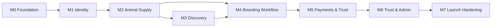
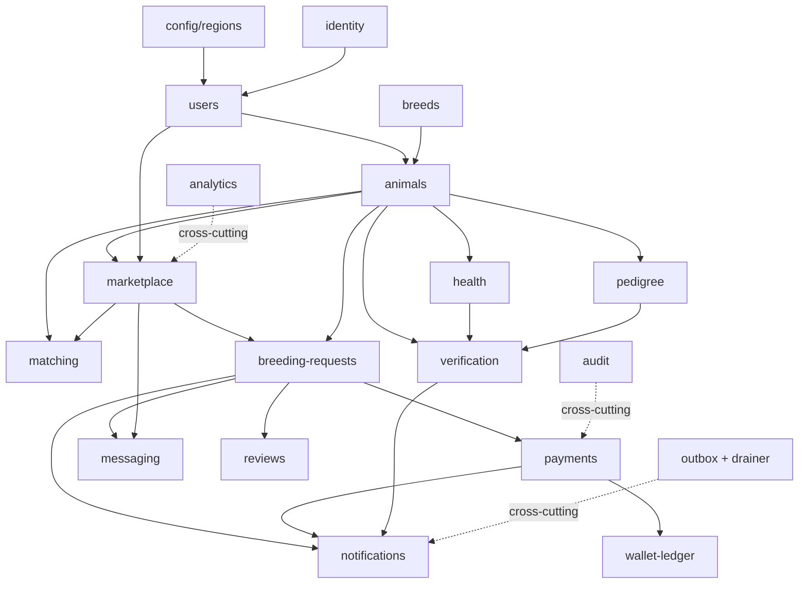

# ImplementationPlan.md

## Purpose & Status

This is the authoritative engineering-execution source of truth for the Pakistan-first, USA-ready verified breeding marketplace. It reconciles the `Agent.md` delivery checkpoints, the `Features.md` product contract, the `Context.md` / `IntegrationGuide.md` architecture and schema, and the `.cursor/Rule.md` business/compliance rules into one plan, then decomposes the build into:

```text
Milestone -> Module -> Feature -> Task
```

Each task carries an estimated complexity, explicit dependencies, and acceptance criteria so the work can be scheduled, staffed, and verified.

### Status

- This document **supersedes** `doc/DeliveryPlan.md`. `DeliveryPlan.md` is now **deprecated**; do not update it. If milestones, modules, dependencies, estimates, or acceptance criteria change, update **this** file in the same change.
- Companion documents remain authoritative for their domains:
  - `doc/MarketPlan.md` owns business strategy and the *business* risk register.
  - `.cursor/Context.md` and `doc/IntegrationGuide.md` own architecture and schema.
  - `doc/Features.md` owns the product contract and feature-level acceptance criteria.
  - `.cursor/Rule.md` owns business, compliance, privacy, and audit rules.
- This file owns the *engineering execution* view: what gets built, in what order, by whom, with what effort, delivery risk, and done-criteria.

### How to use this document

1. Confirm the target phase (MVP Pakistan unless explicitly stated otherwise).
2. Before starting a milestone, confirm its entry criteria are met and all upstream modules in the dependency graph are merged.
3. Before starting a High-risk module, schedule specialist review per `doc/Skill.md`.
4. Treat each task's acceptance criteria as the minimum bar; the global Definition of Done in `Claude.md` still applies to every change.

### Current repository state (validated)

Only the **foundation** is built today:

- pnpm + Turborepo monorepo, `apps/web` (Next.js App Router) and `apps/api` (NestJS) scaffolds.
- `system` module exposing `GET /api/v1/health`; Swagger scaffold.
- `packages/{config,shared,database,ui}` with Zod env validation, shared types/constants/provider interfaces, and a `Button` primitive.
- Docker Compose + Dockerfiles, GitHub Actions CI, `.env.example`.
- `supabase/migrations/20250620000000_foundation.sql` — extensions (`pgcrypto`, `uuid-ossp`) and the `set_updated_at()` trigger function only.

No business tables, RLS policies, seed data, or domain modules exist yet. Practical net-new engineering begins at **M1**, with a short **M0** to close foundation gaps.

## Table of Contents

1. [Requirements Validation](#requirements-validation)
2. [Milestones](#milestones)
3. [Module Catalog](#module-catalog)
4. [Dependencies](#dependencies)
5. [Risks (Delivery / Technical)](#risks-delivery--technical)
6. [Folder Structure (Authoritative)](#folder-structure-authoritative)
7. [Estimated Complexity](#estimated-complexity)
8. [Global Execution Order](#global-execution-order)
9. [Milestone -> Module -> Feature -> Task](#milestone---module---feature---task)

## Requirements Validation

### Business requirements (recap)

The platform is the trusted **transaction and records layer** for animal breeding (not a classifieds board). Every feature must serve at least one of the four product outcomes from `Agent.md`:

1. More verified breeding **supply**.
2. Higher-quality breeding **demand**.
3. Safer, more **trusted** transactions.
4. Better **repeat usage** through animal records and post-breeding workflows.

Launch geography is Pakistan (PKR, English/Urdu RTL, phone-first, Easypaisa/JazzCash/bank transfer); Phase 3 is the USA (USD, Stripe, state compliance). MVP scope is fixed by the `Features.md` Include/Defer lists, delivered on a domain-driven modular monolith (NestJS API + Next.js web + Supabase).

### Architecture validation (sound, with one open decision)

- **Modular monolith is the right MVP choice.** The 17 bounded contexts in `Context.md` map cleanly to the 20 backend modules; a shared transaction boundary is exactly what breeding-request -> payment -> ledger -> record consistency needs.
- **Dual-layer security is correct.** NestJS RBAC at the API layer plus Supabase RLS at the database layer gives defense-in-depth; service-role usage is isolated to the server.
- **Provider interface abstraction is correct.** `PaymentProvider` / `NotificationProvider` / `StorageProvider` interfaces in `packages/shared` de-risk the unknown Easypaisa/JazzCash capabilities and the Pakistan->USA payment swap.
- **Outbox-over-queue is the right reliability trade-off** given queues are deferred to Phase 4: write side effects to a transactional outbox in the same DB transaction as the state change, then drain via a scheduled worker.
- **Open decision (must resolve before M5): API host.** `Claude.md` / `Setup.md` say "Vercel for API where feasible"; serverless cold starts, execution limits, and webhook handling conflict with long-running payment webhooks and the outbox drainer. Recommendation: deploy `web` on Vercel and the NestJS `api` on a long-running host (Railway / Render / Fly).

### Conflicts detected (resolved in this plan)

- **`docs/` vs `doc/`.** The request named `docs/ImplementationPlan.md`; the repo's authoritative tree uses singular `doc/`. Resolved: this file lives at `doc/ImplementationPlan.md` to avoid folder drift.
- **README docs path drift.** `README.md` lists `doc/Context.md` in its reading order, but `Context.md` actually lives at `.cursor/Context.md`, and the README omits `Claude.md` / `MarketPlan.md` that `Agent.md` includes. Tracked as a doc-fix task in M0.
- **Breeding-status naming mismatch.** The `Features.md` state diagram uses `Draft / Requested / Accepted / PaymentPending / Scheduled / InProgress / Completed / RecordGenerated / Closed / Cancelled / Rejected / Disputed / Refunded`, while `DeliveryPlan.md` used a shorthand (`requested -> accepted -> scheduled -> completed -> record -> closed`). Resolved: the `Features.md` diagram is canonical; M4 publishes a single status enum in `packages/shared` consumed by the API, RLS, and tests.
- **Schema source-of-truth drift risk.** `supabase/migrations/` is the declared SoT, but `packages/database/` ships `seed/seed.sql` and `migrations/.gitkeep`. Resolved: `packages/database/` holds generated types and references only; M1 removes/links any divergent migration/seed copies.
- **`system` vs `health` naming collision (already resolved, restated).** `system` owns the liveness/readiness endpoint (`GET /api/v1/health`); `health` owns the animal clinical-records domain. They are distinct modules; do not conflate.

### Missing requirements to surface (added to the plan)

These are required by the rules/contract but lack schema, values, or endpoints today:

- **Transactional outbox + webhook-dedup tables.** `IntegrationGuide.md` references an outbox pattern but ships no DDL. Add `outbox_messages` and `webhook_events` (provider event dedup) in M1.
- **Rate-limit thresholds.** `Claude.md` requires rate limiting for auth, search, messaging, and request creation, but no values are specified. M0/M1 defines a rate-limit matrix.
- **Eligibility configuration.** `Rule.md` requires minimum age/health checks "by species and region" with no data. M1 seeds eligibility config into `regions.config` (jsonb).
- **Session revocation / account recovery endpoints.** `Features.md` acceptance criteria require force-logout and account recovery, but the API contract table omits them. M1 adds `POST /api/v1/admin/users/:id/revoke-sessions` and recovery flows.
- **Phone-number masking reveal rule.** `Rule.md` / `Features.md` require hiding phone numbers until a request reaches `accepted`/`scheduled`; the exact reveal trigger is specified in M4 messaging.
- **Data-retention periods.** `Rule.md` defers retention periods but they are a launch blocker; M7 requires defined retention per data class before production.
- **Field Onboarding Rep RBAC.** Implemented as a scoped variant of Support for MVP; M1 records the role decision and attribution/audit fields.

### Proposed improvements (folded into milestones)

- **Stand up cross-cutting cores early (M1, not M5).** Build `audit`, `analytics`, and `notifications` cores plus the outbox in M1 so every later domain module emits events from day one. Missing audit events are treated as test failures.
- **Canonical enums in `packages/shared`.** Publish breeding-request status, payment status/purpose, verification dimensions, and listing status as shared enums consumed by API, DTO validation, and tests to prevent layer drift.
- **Resolve API host before M5.** Default `web` -> Vercel, `api` -> long-running host; confirm webhook + outbox-drainer behavior on the chosen host.
- **Seed PK liquidity early.** Seed PK region, priority breeds (cattle, buffalo, goat, sheep, dog), and eligibility config in M1 so M2/M3 have realistic data.

## Milestones

Milestones reconcile `Agent.md` checkpoints (1-5), the 90-day roadmap, and the sprint plan. Windows are indicative for a lean team (see `MarketPlan.md` team structure); overlapping windows assume limited parallelism and are a scheduling risk (see Risks). Each milestone has explicit **entry** and **exit** criteria.

| Milestone | Maps To | Window | Entry Criteria | Exit Criteria |
| --- | --- | --- | --- | --- |
| **M0 Foundation** | Sprint 0 | Days 1-12 | Repo scaffold exists (current state). | Foundation gaps closed: rate-limit + RBAC/RLS test harness, migration/OpenAPI CI gates, design-system RTL shell, doc-drift fixes. App boots locally end-to-end. |
| **M1 Identity & Profiles** | Checkpoint 1 / Sprint 1 | Days 8-22 | M0 exit met. | Email + phone-OTP auth, roles, profile completion; `config/regions`, `breeds` seeded; `audit`/`analytics`/`notifications` cores + outbox live; RLS baseline; admin can list users. |
| **M2 Animal Supply** | Checkpoint 2 / Sprint 2 | Days 18-38 | M1 exit met (`users`, `breeds`, `regions`). | Animal CRUD, media upload via signed URLs, health + pedigree records, breeder profiles, listing drafts. Verification badges visible, default unverified. |
| **M3 Discovery** | Sprint 3 | Days 34-54 | M2 exit met (`animals` publishable). | Listing publish, full-text search + filters, listing detail, SEO city/species pages, saved listings, discovery analytics events. |
| **M4 Breeding Workflow** | Checkpoint 3 / Sprint 4 | Days 50-70 | M2 + M3 exit met. | Request lifecycle (canonical status enum), `breeding_request_events`, breeding-record generation, messaging with phone masking, workflow notifications. |
| **M5 Payments & Trust** | Checkpoint 4 / Sprint 5 | Days 66-84 | M4 exit met; API host resolved; provider sandbox or stubs ready. | Payment intents, bank-transfer proof, Easypaisa/JazzCash adapters or stubs, immutable ledger, protected-payment states, boosts/subscriptions, admin reconciliation, audit logs. |
| **M6 Trust & Admin** | Sprint 6 | Days 78-92 | M5 exit met. | Vet/inspector verification workflows, disputes with reason codes + resolution, reviews/reputation, content moderation, audit explorer, admin dashboards. |
| **M7 Launch Hardening** | Checkpoint 5 / Sprint 7 | Days 86-100 | M6 exit met. | RBAC/state-transition test coverage, security review, performance checks, observability + alerts, restore + webhook-replay tests, retention policy, seed supply, beta instrumentation. |



> Cross-cutting modules (`audit`, `analytics`, `notifications`) and the transactional outbox are built in M1 and consumed by every later milestone via domain events. Wire emitters as each producing module lands.

## Module Catalog

Modules follow the domain-driven modular monolith in `Claude.md`. Each NestJS module follows the structure in `IntegrationGuide.md`: `controller`, `service`, `repository`, `dto/`, `entities/`, `policies/`, `events/`, `module`.

> Naming note: the liveness/readiness module is `system`. The animal clinical-records module is `health`. These are distinct; do not conflate them.

| Module | Milestone | Scope | Owned Tables | Key Endpoints | Owner |
| --- | --- | --- | --- | --- | --- |
| `system` | M0 | Liveness/readiness, build info, Swagger | none | `GET /api/v1/health` | DevOps/Backend |
| `config/regions` | M1 | Region, currency, locale, eligibility + compliance config | `regions` | admin region config | Backend/Compliance |
| `identity` | M1 | Auth provider linkage, sessions, OTP, account status, recovery | Supabase `auth.users` | `POST /auth/profile`, session revoke | Backend |
| `users` | M1 | Profiles, roles, locale, notification prefs, consents | `profiles`, `user_roles`, `notification_preferences`, `consents` | `GET/PATCH /me`, `GET/PATCH /admin/users` | Backend |
| `audit` | M1 | Append-only record of critical actions | `audit_logs` | admin audit explorer (M6) | Backend |
| `analytics` | M1 | Event ingestion, funnels, dashboards | `analytics_events` | event capture + dashboards (M6) | Backend/Product |
| `notifications` | M1 | Email/SMS/push templates, device tokens, delivery logs, outbox drain | `devices`, `notification_logs`, `notification_preferences`, `outbox_messages` | `/devices*`, `/me/notification-preferences` | Backend |
| `breeds` | M1 | Species/breed taxonomy + seed | `breeds` | admin breed taxonomy | Backend |
| `animals` | M2 | Animal profiles, media, signed URLs, soft delete | `animals`, `animal_media` | `/animals*`, media upload-url | Backend |
| `health` | M2 | Clinical records, vaccination, fertility, readiness | `health_records` | `/animals/:id/health-records` | Backend |
| `pedigree` | M2 | Lineage, registry, DNA documents | `pedigree_records` | `/animals/:id/pedigree` | Backend |
| `marketplace` | M3 | Listings, publish, boosts, featured, availability, saved listings | `listings`, `boost_orders`, `saved_listings` | `/listings*`, `/listings/:id/boost`, `/saved-listings` | Backend |
| `matching` | M3 | Search, filters, deterministic compatibility scoring, distance | reads `listings`/`animals` | `GET /listings` (search) | Backend |
| `breeding-requests` | M4 | Request lifecycle, schedule, completion, records, disputes | `breeding_requests`, `breeding_request_events`, `breeding_records`, `disputes` | `/breeding-requests*` | Backend |
| `messaging` | M4 | Conversations, messages, attachments, moderation, phone masking | `conversations`, `conversation_participants`, `messages` | `/conversations*`, `/messages/:id/report` | Backend |
| `payments` | M5 | Provider integrations, intents, webhooks, refunds, subscriptions, boost purchase | `payment_intents`, `webhook_events`, `subscription_plans`, `subscriptions` | `/payments*`, `/subscriptions*` | Backend (specialist review) |
| `wallet-ledger` | M5 | Immutable financial records, payouts | `ledger_entries`, `payouts`, `payout_accounts` | `/admin/payments/*`, `/payouts*` | Backend (specialist review) |
| `verification` | M2 badges / M6 workflow | KYC/KYB, animal/health/pedigree/facility verification | `verification_requests` | `/verifications*`, `/admin/verifications/*` | Backend/Compliance |
| `reviews` | M6 | Ratings, reputation, dispute-weighted feedback | `reviews` | `/reviews*` | Backend |
| `admin` | M6 | Moderation, configuration, support tooling, reconciliation UI | cross-module | `/admin/*` | Backend/Product |

> `verification` lands in two stages: passive badges (default `unverified`) in M2, and the active vet/inspector approval workflow + admin queue in M6 (with the queue/reconciliation surfaced in M5).

## Dependencies

### Internal build order



Cross-cutting modules (`audit`, `analytics`, `notifications`) and the outbox are built first (M1) and wired into each producing module as it lands.

### External & critical-path dependencies

| Dependency | Blocks | Lead-Time Risk | Mitigation |
| --- | --- | --- | --- |
| Easypaisa/JazzCash merchant approval | M5 live payments | High (third-party onboarding) | Build behind `PaymentProvider` interface; ship bank-transfer + stubs first. |
| Pakistan SMS deliverability | M1 phone OTP, M4 notifications | Medium | Validate against live networks early; fall back to Supabase phone auth / alternate aggregator. |
| Supabase project + tiers | M0 onward | Low | Provision in M0; confirm PITR plan before M7. |
| API host decision (Vercel vs long-running) | M0 setup, M5 webhooks | Medium | Resolve in M0; default `api` -> Railway/Render/Fly, `web` -> Vercel. |
| Legal review of protected-payment structure | M5/M6 | High | Do not claim regulated escrow; ledger-state model until cleared. |
| Vet/inspector recruitment | M6 | Medium | Manual onboarding; workflows usable with few participants. |
| Eligibility data (min age/health by species/region) | M4 request validation | Medium | Seed conservative PK defaults in M1; refine with domain input. |

## Risks (Delivery / Technical)

This register covers execution and technical risk. Business/market risk lives in `MarketPlan.md`.

| Risk | Likelihood | Impact | Mitigation |
| --- | --- | --- | --- |
| NestJS on Vercel serverless (cold starts, exec limits, webhook handling) | Medium | High | Resolve API host in M0; prefer long-running host for the API. |
| No queue in MVP undermines webhook/notification reliability | Medium | High | Transactional outbox (`outbox_messages`) + scheduled drain in M1; real queue in Phase 4. |
| Payment provider behavior unknown (split/hold support) | High | High | Provider interface + manual reconciliation + idempotency keys; validate capabilities before promising holds. |
| `search_vector` not auto-populated | Medium | Medium | DB trigger maintains tsvector on insert/update (per `IntegrationGuide.md`); covered in M3. |
| Ledger/audit mutated by app bug | Low | High | Enforce append-only via DB grants (revoke UPDATE/DELETE), not convention. |
| Breeding-status enum drift across layers | Medium | High | Single canonical enum in `packages/shared`; state-transition tests required. |
| Scope creep from deferred features pulled into MVP | Medium | Medium | Honor the `Features.md` Defer list; route additions through this plan. |
| Cross-cutting events (audit/analytics/notifications) bolted on late | Medium | Medium | Build cores in M1; treat missing audit events as test failures. |
| RLS/RBAC drift between layers | Medium | High | State-transition + ownership tests per `Agent.md`; specialist review for High-risk modules. |
| Urdu RTL layout retrofitted late | Medium | Medium | Bake RTL + i18n keys into the design system in M0. |
| Overlapping milestone windows exceed lean-team capacity | Medium | Medium | Treat windows as indicative; gate each milestone on entry criteria, not dates. |
| Webhook replay / duplicate event handling | Medium | High | `webhook_events` dedup table + idempotency keys; webhook-replay test in M7. |

## Folder Structure (Authoritative)

Product/architecture markdown lives in `doc/`; agent-governing rules and context live in `.cursor/`. `supabase/migrations/` is the schema source of truth.

```text
.
├── apps/
│   ├── web/                     # Next.js App Router frontend
│   │   ├── app/                 # routes (SSR/SEO pages, dashboards, workflows)
│   │   ├── components/          # shared presentational components
│   │   ├── features/            # feature modules (auth, animals, listings, ...)
│   │   ├── lib/                 # api client, query hooks, zustand stores
│   │   ├── messages/            # en.json, ur.json (RTL-aware)
│   │   └── public/
│   └── api/                     # NestJS REST API (/api/v1)
│       ├── src/
│       │   ├── main.ts
│       │   ├── app.module.ts
│       │   ├── common/          # guards, interceptors, filters, pagination
│       │   ├── config/
│       │   ├── modules/         # system, identity, users, animals, ...
│       │   └── openapi/
│       └── test/
├── packages/
│   ├── config/                  # Zod-validated env config (web + api)
│   ├── database/                # generated Supabase types + tooling refs (NOT a 2nd schema)
│   ├── shared/                  # types, constants, enums, provider interfaces
│   └── ui/                      # shared React primitives (RTL-aware)
├── supabase/                    # SOURCE OF TRUTH for schema
│   ├── migrations/
│   ├── policies/
│   └── seed.sql
├── docker/                      # Docker Compose + Dockerfiles
├── .github/
│   └── workflows/               # CI/CD
├── doc/                         # product, market, architecture blueprint
│   ├── Agent.md
│   ├── Claude.md
│   ├── DeliveryPlan.md          # DEPRECATED — superseded by ImplementationPlan.md
│   ├── Features.md
│   ├── ImplementationPlan.md    # this file (engineering execution SoT)
│   ├── Integration.md
│   ├── IntegrationGuide.md
│   ├── MarketPlan.md
│   ├── Pricing.md
│   ├── Setup.md
│   └── Skill.md
└── .cursor/                     # agent-governing docs
    ├── Context.md
    └── Rule.md
```

> Migration source of truth is `supabase/migrations/`. `packages/database/` holds generated types and references only; it must not contain a divergent copy of schema migrations or seeds.

### Per-module backend layout (repeated for every module)

```text
modules/<module>/
├── <module>.controller.ts
├── <module>.service.ts
├── <module>.repository.ts
├── dto/
├── entities/
├── policies/                    # RBAC + ownership policies
├── events/                      # domain events (audit/analytics/notifications)
└── <module>.module.ts
```

## Estimated Complexity

T-shirt sizing per module: **S** (~2-3 dev-days), **M** (~4-7), **L** (~8-12), **XL** (~13+). "Risk" reflects compliance/financial sensitivity and the need for specialist review (see `Skill.md`).

| Module | Size | Risk | Notes |
| --- | --- | --- | --- |
| `system` | S | Low | Liveness/readiness + Swagger (mostly built). |
| `config/regions` | S | Low | Seed PK/US; jsonb compliance + eligibility config. |
| `identity` | M | Medium | Phone OTP + deliverability, session revoke, recovery. |
| `users` | M | Medium | Roles, prefs, consents, RLS, Field Rep variant. |
| `audit` | M | High | Append-only enforcement; coverage of privileged actions. |
| `analytics` | M | Low | Event capture + dashboards; privacy filters. |
| `notifications` | M | Medium | Multi-channel localized templates, outbox drainer, device tokens. |
| `breeds` | S | Low | Taxonomy + seed. |
| `animals` | L | Medium | CRUD + media + signed URLs + soft delete + eligibility fields. |
| `health` | M | Medium | Private records, signed URLs. |
| `pedigree` | M | Medium | Lineage + registry + documents. |
| `marketplace` | L | Medium | Listings, publish, boosts, saved listings, SEO surface. |
| `matching` | M | Low | Deterministic scoring + distance + full-text search. |
| `breeding-requests` | XL | High | State machine, events, records, disputes — core domain. |
| `messaging` | L | Medium | Realtime chat, attachments, moderation, phone masking. |
| `payments` | XL | High | Providers, webhooks, idempotency, subscriptions; specialist review. |
| `wallet-ledger` | L | High | Immutable ledger, payouts; specialist review. |
| `verification` | L | High | KYC/KYB + animal/health/pedigree/facility; compliance review. |
| `reviews` | M | Medium | Reputation rules, dispute weighting. |
| `admin` | L | Medium | Cross-module moderation + config + reconciliation UI. |

The critical path is `breeding-requests` + `payments` + `wallet-ledger` + `verification` (all High risk); allocate the most senior backend time and specialist review there.

## Global Execution Order

The end-to-end sequence (expands `IntegrationGuide.md` "Implementation Sequence"):

1. **M0** — Close foundation gaps: rate-limit config, RBAC/RLS + state-transition test harness, migration + OpenAPI CI gates, design-system RTL shell, doc-drift fixes.
2. **M1** — Supabase local + migrations; `config/regions` + `breeds` seed; `identity` (auth/OTP); `users` (profiles/roles/consents); cross-cutting cores (`audit`, `analytics`, `notifications`) + outbox; RLS baseline; admin user list.
3. **M2** — `animals` CRUD + media; `health`; `pedigree`; verification badges (passive).
4. **M3** — `marketplace` listings + publish + `search_vector` trigger; `matching` search/filters/scoring; saved listings; SEO surfaces; discovery analytics.
5. **M4** — `breeding-requests` state machine + events + records + dispute scaffold; `messaging` with phone masking; workflow notifications.
6. **M5** — `payments` intents/webhooks/proof/refunds; `wallet-ledger`; boosts/subscriptions; admin reconciliation; verification queue surface.
7. **M6** — Active `verification` (vet/inspector); dispute resolution; `reviews`/reputation; `admin` moderation + audit explorer + dashboards.
8. **M7** — QA (RBAC/state coverage), security + performance review, observability + alerts, restore + webhook-replay tests, retention policy, seed supply, beta instrumentation.

## Milestone -> Module -> Feature -> Task

Each task is written as: **complexity (S/M/L/XL)** — **depends on** — **acceptance criteria**. Complexity here is task-level (S ~0.5-1 day, M ~1-2 days, L ~3-4 days, XL ~5+ days). Every task additionally inherits the global Definition of Done in `Claude.md` (compiles, tests pass, OpenAPI updated, reversible migration, RLS/RBAC considered, audit events emitted, UI states handled).

---

### M0 — Foundation

Goal: close foundation gaps so feature work can start cleanly. Entry: current scaffold. Exit: app boots end-to-end with CI gates, test harness, RTL shell, and corrected docs.

#### Module: `system`

- **Feature: Health & build info**
  - Add build/version + dependency readiness (DB ping) to `GET /api/v1/health` — **S** — depends on: none — AC: endpoint returns `status: ok` with version and DB reachability; readiness fails (503) when DB is unreachable.
  - Confirm Swagger served at `/docs` with `/api/v1` prefix — **S** — depends on: none — AC: `/docs` renders; OpenAPI JSON exported for CI validation.

#### Module: platform (cross-cutting foundation in `apps/api/src/common`)

- **Feature: Global API conventions**
  - Global validation pipe + DTO whitelist + error filter returning stable error codes (`ApiErrorBody`) — **M** — depends on: none — AC: invalid payloads return `400` with stable `code`/`message`; unknown fields stripped.
  - Cursor pagination helper in `common/` consumed by all list endpoints — **S** — depends on: none — AC: helper returns `{ data, meta: { nextCursor, hasMore } }`; covered by a unit test.
  - Rate-limit configuration matrix (auth, search, messaging, request creation) — **M** — depends on: none — AC: per-route limits defined and enforced; documented thresholds; 429 returned with retry hint. Closes the missing rate-limit requirement.
- **Feature: Auth/RBAC scaffolding (no business logic yet)**
  - JWT validation guard + role guard + ownership policy base class — **M** — depends on: none — AC: guards reject missing/invalid JWT (401) and insufficient role (403); unit-tested with mock tokens.
  - RBAC/RLS + state-transition **test harness** (helpers + fixtures) — **M** — depends on: guards — AC: reusable helpers exist to assert role matrix and state transitions; one sample test passes in CI.

#### Module: web (design system)

- **Feature: RTL + i18n shell**
  - Tailwind RTL setup + `dir` switching wired to locale; `en.json`/`ur.json` message scaffolding — **M** — depends on: none — AC: toggling locale flips layout direction; no hardcoded UI copy in shell; Urdu renders RTL.
  - Base UI states pattern (loading/empty/error/success) in `packages/ui` — **S** — depends on: none — AC: shared components/utilities exist for the four states and are used by the landing/shell.

#### Module: devops/docs

- **Feature: CI gates**
  - Add migration validation + OpenAPI validation steps to CI — **M** — depends on: `system` Swagger export — AC: CI fails on malformed migration or OpenAPI drift; lint/typecheck/test/build all gate PRs.
  - Resolve API host decision; document in `Setup.md`/`Integration.md` — **S** — depends on: none — AC: chosen host recorded (default `web`->Vercel, `api`->long-running) with webhook/outbox implications noted.
- **Feature: Documentation drift fixes**
  - Fix `README.md` reading-order (`.cursor/Context.md` path; include `Claude.md`/`MarketPlan.md`); add pointer that `DeliveryPlan.md` is superseded — **S** — depends on: none — AC: README links resolve to real paths; `DeliveryPlan.md` notes deprecation to this file.

---

### M1 — Identity & Profiles

Goal: auth, roles, profiles, region/breed config, and cross-cutting cores. Maps to Checkpoint 1. Entry: M0 exit. Exit: users can sign up (email + phone OTP), complete profiles, hold roles; RLS baseline live; audit/analytics/notifications cores + outbox running; admin can list users.

#### Module: `config/regions`

- **Feature: Region configuration**
  - `regions` migration + seed PK (PKR, en/ur, Easypaisa/JazzCash/bank) and US (USD, en, Stripe) — **S** — depends on: M0 — AC: PK and US rows exist with currency, default locale, active flag, jsonb `config`.
  - Eligibility + compliance config in `regions.config` (min age/health by species; PK provincial flags) — **M** — depends on: region seed — AC: conservative PK eligibility defaults seeded and readable via a typed config accessor. Closes the missing eligibility-data requirement.
  - Admin region read/update endpoint — **S** — depends on: region seed, RBAC — AC: admin can read/update region config; change emits audit event; non-admin gets 403.

#### Module: `breeds`

- **Feature: Breed taxonomy**
  - `breeds` migration + seed priority PK breeds (cattle, buffalo, goat, sheep, dog) — **S** — depends on: `regions` — AC: breeds seeded per species with region link; unique (species, name, region).
  - Admin breed taxonomy management — **S** — depends on: breed seed, RBAC — AC: admin can add/edit breeds; changes audited.

#### Module: `identity`

- **Feature: Authentication**
  - Supabase Auth integration: email/password + phone OTP (PK format) — **M** — depends on: M0 guards — AC: a user can sign up with PK-format phone OTP and with email/password; JWT issued and validated by the API.
  - Add email after phone signup; optional social login hook — **S** — depends on: auth base — AC: phone-first user can attach an email; profile reflects both.
  - Account recovery + session/device tracking — **M** — depends on: auth base — AC: user can recover account; active sessions/devices are tracked.
  - Admin force-logout (session revocation) endpoint — **S** — depends on: session tracking, RBAC — AC: `POST /api/v1/admin/users/:id/revoke-sessions` invalidates sessions; action audited. Closes the missing session-revocation requirement.

#### Module: `users`

- **Feature: Profiles & roles**
  - `profiles`, `user_roles` migrations + RLS (owner-read/write own profile) — **M** — depends on: `identity`, `regions` — AC: profile row created on signup completion; RLS prevents reading others' profiles; roles stored.
  - `POST /auth/profile`, `GET/PATCH /me` — **M** — depends on: profiles migration — AC: profile completion enforces required fields; `/me` returns user, roles, permissions; updates audited.
  - Role assignment + Field Onboarding Rep as scoped Support variant — **M** — depends on: roles, RBAC — AC: admin assigns roles (audited); Field Rep can create/assist profiles with consent + attribution, cannot touch payments/disputes. Closes the Field-Rep RBAC decision.
  - Admin user search + suspend/reactivate — **M** — depends on: profiles, RBAC — AC: `GET /admin/users` paginates/searches; `PATCH /admin/users/:id/status` suspends (suspended users blocked from listings/requests) and audits.
- **Feature: Notification preferences & consent**
  - `notification_preferences`, `consents` migrations + endpoints — **M** — depends on: profiles — AC: per channel/category prefs editable; marketing requires explicit opt-in recorded with type+version in `consents`; consent grant/withdraw audited.

#### Module: `audit` (cross-cutting core)

- **Feature: Append-only audit log**
  - `audit_logs` migration + DB grants revoking UPDATE/DELETE — **M** — depends on: M0 — AC: rows are insert-only; UPDATE/DELETE rejected at DB level; verified by test.
  - Audit emitter (interceptor/service) + event catalog — **M** — depends on: audit table — AC: privileged actions (role change, suspend, etc.) emit audit rows with actor/subject/ip/ua; missing audit events fail tests.

#### Module: `analytics` (cross-cutting core)

- **Feature: Event ingestion**
  - `analytics_events` migration + capture service with privacy filters — **M** — depends on: M0 — AC: events recorded with user/region/properties; no private health/payment/identity payloads stored; `user_signed_up` emitted.

#### Module: `notifications` (cross-cutting core)

- **Feature: Outbox + delivery**
  - `outbox_messages` + `notification_logs` + `devices` migrations — **M** — depends on: M0 — AC: outbox rows written in same transaction as state changes; schema supports channel/template/status. Closes the missing outbox requirement.
  - Scheduled outbox drainer + `NotificationProvider` stub (email/SMS/push) — **L** — depends on: outbox migration — AC: drainer delivers pending messages idempotently, logs results, retries failures; localized template lookup (en/ur) supported.
  - Device token register/remove + preference enforcement — **S** — depends on: `users` prefs — AC: `POST/DELETE /devices`; disabled categories are not delivered; transactional categories flagged non-optional.

---

### M2 — Animal Supply

Goal: animal profiles, media, health, pedigree, passive verification badges. Maps to Checkpoint 2. Entry: M1 exit. Exit: owners/breeders create animals with media + health + pedigree; badges visible default unverified.

#### Module: `animals`

- **Feature: Animal profile CRUD**
  - `animals` migration (all `Features.md` fields) + RLS (owner manage own; soft delete) — **L** — depends on: M1 `users`/`breeds`/`regions` — AC: owner can create/read/update/soft-delete own animal; RLS blocks cross-owner writes; `deleted_at` hides records.
  - `POST/GET/PATCH/DELETE /animals` + draft/publish state + eligibility fields — **L** — depends on: animals migration — AC: draft created with partial data; publish blocked until required eligibility fields present (species, breed, sex, location, declaration, min-age, health-not-blocked, >=1 image); profile changes audited.
- **Feature: Media management**
  - `animal_media` migration + signed upload URL endpoint + visibility — **L** — depends on: animals migration, `StorageProvider` — AC: `POST /animals/:id/media/upload-url` returns a signed URL scoped to owner; private media requires signed read URLs; sort order respected.

#### Module: `health`

- **Feature: Clinical records**
  - `health_records` migration + RLS (private by default) — **M** — depends on: `animals` — AC: records private to owner/vet/admin; types cover vaccination/deworming/disease/fertility/pregnancy/certificate/contraindication.
  - `POST /animals/:id/health-records` + signed document URLs + vet linkage — **M** — depends on: health migration — AC: owner/vet adds records; documents use signed URLs; record creation audited; readiness fields settable.

#### Module: `pedigree`

- **Feature: Lineage & registry**
  - `pedigree_records` migration + sire/dam links + registry/DNA documents — **M** — depends on: `animals` — AC: lineage entries (including manual offline ancestry) stored; registry name/number + document path captured; self-referential sire/dam links valid.
  - `POST /animals/:id/pedigree` endpoint — **S** — depends on: pedigree migration — AC: owner adds pedigree; default `verification_status = unverified`; change audited.

#### Module: `verification` (passive badges)

- **Feature: Verification badges (display only)**
  - `verification_requests` migration + additive badge model — **M** — depends on: `animals`/`health`/`pedigree` — AC: animals/profiles expose per-dimension verification status (owner identity, media, health, vaccination, pedigree, facility, vet, inspector); default `unverified`; UI never shows bare "verified" without the dimension.

---

### M3 — Discovery

Goal: listings, publish, search/filters, listing detail, SEO, saved listings. Maps to Sprint 3. Entry: M2 exit. Exit: listings publishable and searchable with SEO surfaces and saved listings.

#### Module: `marketplace`

- **Feature: Listings lifecycle**
  - `listings` migration + status enum (draft/pending/active/paused/expired/rejected/suspended) + RLS (active public-readable) — **L** — depends on: `animals` — AC: owner CRUDs own listing; only `active` + non-deleted listings are public; statuses match `Features.md`.
  - `POST /listings`, `PATCH /listings/:id`, `POST /listings/:id/publish` — **M** — depends on: listings migration — AC: publish validates listing-type + required fields; publish/unpublish audited; `listing_viewed`/`animal_published` analytics emitted as relevant.
- **Feature: Saved listings**
  - `saved_listings` migration + `GET/POST/DELETE /saved-listings` — **S** — depends on: listings — AC: save/unsave is idempotent; suspended/soft-deleted listings excluded; save emits analytics event.

#### Module: `matching`

- **Feature: Search & filters**
  - `search_vector` trigger + GIN index + cursor-paginated `GET /listings` search — **L** — depends on: listings — AC: tsvector auto-maintained on insert/update (no app writes); filters by species/breed/sex/location+distance/fee/verification/availability/health/pedigree/method; `search_performed` emitted.
  - Deterministic compatibility scoring + distance — **M** — depends on: search — AC: score uses the `Features.md` weight table (breed 25, health 20, pedigree 15, distance 15, verification 10, outcomes 10, dispute 5); deterministic ordering with documented tie-break; unit-tested.

#### Module: web (discovery surfaces)

- **Feature: SEO & listing detail**
  - SSR city/species SEO pages + listing detail page — **L** — depends on: search API — AC: server-rendered pages with structured metadata; localized (en/ur, RTL); loading/empty/error/success states; no phone numbers exposed on public pages.

---

### M4 — Breeding Workflow

Goal: request lifecycle, records, messaging, notifications. Maps to Checkpoint 3. Entry: M2 + M3 exit. Exit: requests traverse the full state machine, generate records, with masked-phone messaging and workflow notifications.

#### Module: `breeding-requests`

- **Feature: Canonical status model**
  - Publish breeding-request status enum + transition map in `packages/shared` — **M** — depends on: M0 shared pkg — AC: single enum (`Draft/Requested/Accepted/Rejected/PaymentPending/Scheduled/InProgress/Completed/RecordGenerated/Closed/Cancelled/Disputed/Refunded`) consumed by API, DTOs, tests; reconciles the prior naming mismatch.
- **Feature: Request lifecycle**
  - `breeding_requests` + `breeding_request_events` migrations + RLS (participant/admin only) — **L** — depends on: `animals`, `marketplace` — AC: requester/recipient/admin can read; events row written on every status change; RLS blocks non-participants.
  - `POST /breeding-requests` with eligibility + business-rule validation — **L** — depends on: requests migration, `config/regions` eligibility — AC: enforces no self-mating (unless record-only), both accounts active, animals active/not-deleted, opposite-sex for natural, supported method (`natural`/`artificial_insemination`/`semen_purchase`/`record_only`), min age/health; `breeding_request_created` emitted.
  - Transition endpoints: accept/reject/schedule/complete + guards — **L** — depends on: lifecycle base — AC: each transition validated against the state map and RBAC (accept only by recipient); illegal transitions rejected; each transition audited + event-logged; state-transition tests pass.
  - Dispute open + `disputes` migration (resolution deferred to M6) — **M** — depends on: lifecycle — AC: `POST /breeding-requests/:id/dispute` creates dispute with reason code; request moves to `Disputed`; `dispute_opened` emitted.
- **Feature: Breeding record generation**
  - `breeding_records` migration + `POST /breeding-requests/:id/record` (idempotent) — **M** — depends on: completion transition — AC: completing generates exactly one record (unique per request); record captures animals/owners/method/date/location/vet refs/outcome; `record_generated` emitted; regeneration is idempotent.

#### Module: `messaging`

- **Feature: Conversations & messages**
  - `conversations`, `conversation_participants`, `messages` migrations + RLS (participants/support) — **L** — depends on: `breeding-requests`, `marketplace` — AC: conversation tied to a request or listing; only participants/support read; `GET/POST` messages paginated; attachments use signed URLs.
  - Phone-number masking + reveal rule — **M** — depends on: conversations — AC: phone numbers hidden in messages/listings until the linked request reaches `Accepted`/`Scheduled` (or regional policy permits); masking covered by a test. Closes the missing masking-rule requirement.
  - Report message + support freeze — **S** — depends on: conversations — AC: `POST /messages/:id/report` flags message visible to support; support can freeze a disputed conversation.

#### Module: `notifications` (workflow wiring)

- **Feature: Workflow notifications**
  - Emit outbox messages on request/record/message events (localized) — **M** — depends on: M1 outbox, `breeding-requests`, `messaging` — AC: key transitions enqueue localized email/SMS/push per user prefs; transactional categories always delivered; delivery logged.

---

### M5 — Payments & Trust

Goal: payments, ledger, monetization, reconciliation. Maps to Checkpoint 4. Entry: M4 exit; API host resolved. Exit: payment intents, proofs, provider adapters/stubs, immutable ledger, protected-payment states, boosts/subscriptions, admin reconciliation, audited.

#### Module: `payments`

- **Feature: Payment intents & providers**
  - `payment_intents` + `webhook_events` migrations + idempotency keys — **L** — depends on: M4, `PaymentProvider` interface — AC: intents created with unique (provider, idempotency_key); `webhook_events` dedups provider events; client-reported status never trusted. Closes the missing webhook-dedup requirement.
  - `POST /payments/intents` for deposit/full/boost/subscription purposes — **M** — depends on: intents migration — AC: intent maps to purpose + request/payee; `payment_initiated` emitted; protected-payment status states represented.
  - Provider webhook handler (signature-verified, idempotent) + Easypaisa/JazzCash adapters or stubs — **L** — depends on: webhook_events — AC: `POST /payments/:provider/webhook` verifies signature, dedups via `webhook_events`, transitions intent; unverified signatures rejected; `payment_confirmed` emitted.
  - Bank-transfer proof upload — **S** — depends on: intents, `StorageProvider` — AC: `POST /payments/:id/proof` stores private proof (signed URL); proof access audited.
- **Feature: Subscriptions & boosts**
  - `subscription_plans`, `subscriptions` migrations + endpoints — **M** — depends on: payments base — AC: plans listed per region; subscribe/cancel-at-period-end works; status tracked.
  - `boost_orders` migration + `POST /listings/:id/boost` purchase — **M** — depends on: payments base, `marketplace` — AC: boost purchase creates order + payment intent (idempotent); active boost affects listing visibility window.

#### Module: `wallet-ledger`

- **Feature: Immutable ledger**
  - `ledger_entries` migration + DB grants revoking UPDATE/DELETE — **M** — depends on: payments — AC: every confirmed payment writes balanced ledger entries; entries insert-only; verified by test. Revenue never computed only from provider dashboards.
- **Feature: Payouts**
  - `payout_accounts`, `payouts` migrations + endpoints (idempotent) + admin approve/release — **L** — depends on: ledger — AC: owner adds payout account; payout created with unique (provider, idempotency_key); `POST /admin/payouts/:id/approve` releases + audits.
- **Feature: Admin reconciliation**
  - `POST /admin/payments/:id/reconcile` + `POST /admin/payments/:id/refund` (reason code) — **M** — depends on: ledger — AC: manual reconciliation + refund write ledger entries and audit events; refund requires reason code.

#### Module: `verification` (queue surface)

- **Feature: Verification request + queue**
  - `POST /verifications` + `GET /admin/verifications` queue — **M** — depends on: M2 verification, RBAC — AC: users submit verification requests by dimension; admin queue paginates pending items (approve/reject handled in M6).

---

### M6 — Trust & Admin

Goal: vet/inspector workflows, disputes resolution, reviews, moderation, audit explorer, dashboards. Maps to Checkpoint 5 (partial). Entry: M5 exit. Exit: trust workflows operational and admin can moderate, resolve, and observe.

#### Module: `verification` (active workflows)

- **Feature: Approval workflows**
  - `POST /admin/verifications/:id/approve|reject` + vet/inspector scoped actions — **L** — depends on: M5 queue — AC: admin approves/rejects; vet verifies health-only, inspector evidence-only (per RBAC matrix); approval updates subject verification dimension + emits `verification_approved` + audit.

#### Module: `breeding-requests` (dispute resolution)

- **Feature: Dispute resolution**
  - `GET /admin/disputes`, `GET /disputes/:id`, assign + resolve with reason/resolution codes — **L** — depends on: M4 dispute open — AC: support assigns + resolves disputes; resolution can trigger refund (via payments); negative reputation withheld until support review; open/resolve audited.

#### Module: `reviews`

- **Feature: Ratings & reputation**
  - `reviews` migration + `POST /reviews` (post-completion only) + edit window — **M** — depends on: M4 completion — AC: one review per reviewer per request; only after eligible completed request (or support exception); rating 1-5; creating a review emits an audit-relevant event.
  - Reputation surfacing + moderation — **M** — depends on: reviews — AC: reputation weights verification + completion over raw stars; `POST /admin/reviews/:id/moderate` approve/hide; hidden/soft-deleted reviews excluded from public reputation; dispute-influenced reviews flagged.

#### Module: `admin`

- **Feature: Moderation & support tooling**
  - Content reports + listing/animal suspension + support queue — **L** — depends on: `marketplace`, `messaging` — AC: support can suspend a listing immediately for fraud/cruelty/disease/illegal; exotic listings require category approval; actions audited.
- **Feature: Audit explorer & dashboards**
  - Audit log explorer (admin-scoped) + analytics dashboards — **L** — depends on: M1 `audit`/`analytics` — AC: admin queries audit logs (filtered by actor/action/subject); business dashboards show revenue, active breeders/owners, search-to-request, completion rate, dispute rate, verification throughput, boost/subscription conversion; admin document access audited.

---

### M7 — Launch Hardening

Goal: QA, security, performance, observability, DR, retention, seed supply, beta. Maps to Checkpoint 5 (completion). Entry: M6 exit. Exit: production-ready per `Setup.md` launch checklist.

#### Module: QA & compliance

- **Feature: Test coverage**
  - RBAC + animal-ownership + breeding-state-transition + ledger-consistency + verification/audit-event tests — **XL** — depends on: all modules — AC: every role-gated and state-transition path has a test; no feature ships without role + state-transition tests (per `Agent.md`); CI enforces.
- **Feature: Compliance & retention**
  - Define data-retention periods per data class + right-to-erasure flow — **M** — depends on: `users`, `audit`, `wallet-ledger` — AC: retention documented per data class; erasure soft-deletes/redacts personal identifiers while retaining legally required financial/audit records. Closes the missing retention requirement.

#### Module: security & performance

- **Feature: Security review**
  - RLS review, signed-URL expiry, CORS, webhook signatures, secret isolation, PII scrubbing — **L** — depends on: all modules — AC: `Setup.md` security checklist fully satisfied; service role isolated to server; Sentry PII scrubbing + PostHog privacy filters enabled.
  - Performance checks (search latency, query latency, upload failures) — **M** — depends on: M3/M2 — AC: search and key endpoints meet target latency under seed load; slow queries indexed.

#### Module: devops & observability

- **Feature: Observability & alerts**
  - Logs/metrics/alerts per `Setup.md` (payment webhook failures, error rate, auth/storage outages, suspicious admin activity) — **L** — depends on: all modules — AC: dashboards + alerts live; alert fires in a staged failure test.
- **Feature: DR & launch readiness**
  - Restore test + payment webhook-replay test + full breeding-request smoke — **L** — depends on: M5, backups — AC: restore into staging succeeds; replayed webhooks are idempotent (no duplicate ledger entries); end-to-end breeding-request workflow smoke passes.
  - Seed supply + beta instrumentation — **M** — depends on: M2/M3 — AC: seed verified breeders/animals for launch liquidity; beta funnel events instrumented and visible on dashboards.

## Checkpoint

This plan is the engineering execution source of truth and supersedes `DeliveryPlan.md`. Before starting a milestone, confirm its entry criteria are met, the upstream modules in the dependency graph are merged, and any High-risk module on the path has specialist review scheduled per `Skill.md`. Update milestones, module scope, dependencies, estimates, and acceptance criteria here whenever scope or sequencing changes, and update the companion documents named in `Claude.md`'s documentation rule in the same change.


