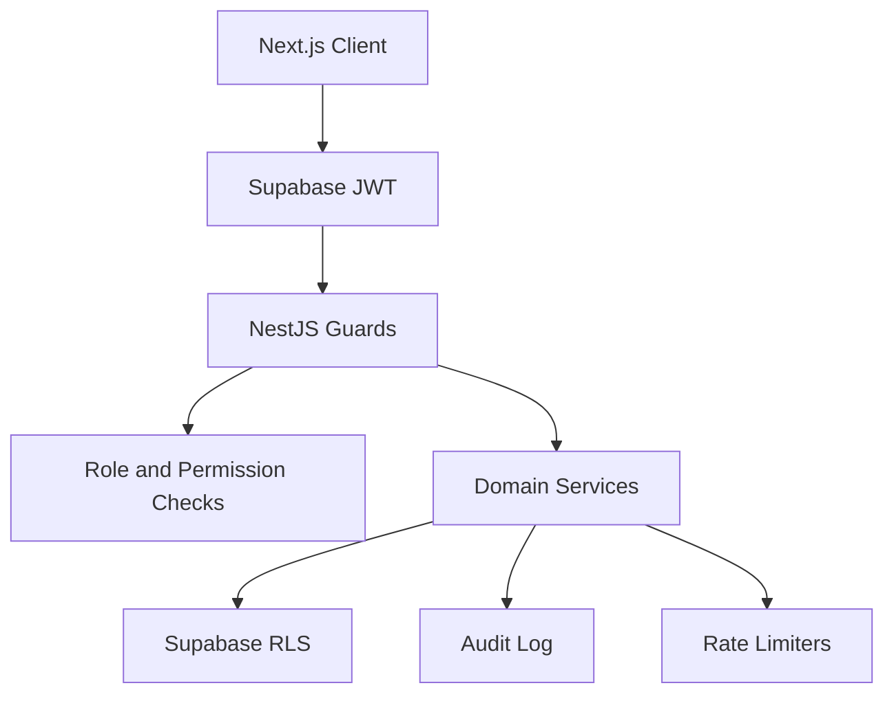
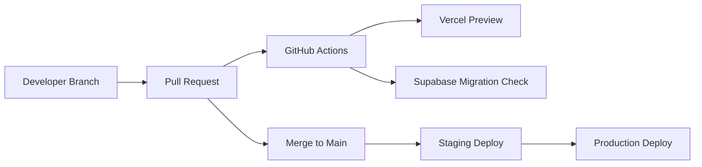

# IntegrationGuide.md

## Implementation Guide

This guide is the primary technical blueprint for building the MVP.

## Repository Structure

Monorepo (authoritative; see `DeliveryPlan.md` for the canonical tree):

```text
.
├── apps/
│   ├── web/
│   │   ├── app/
│   │   ├── components/
│   │   ├── features/
│   │   ├── lib/
│   │   ├── messages/            # en.json, ur.json (RTL-aware)
│   │   └── public/
│   └── api/
│       ├── src/
│       │   ├── main.ts
│       │   ├── app.module.ts
│       │   ├── common/
│       │   ├── config/
│       │   ├── modules/
│       │   └── openapi/
│       └── test/
├── packages/
│   ├── config/
│   ├── database/                # generated types + tooling refs only (not a 2nd schema)
│   │   ├── seed/
│   │   └── types/
│   ├── shared/
│   └── ui/
├── supabase/                    # SOURCE OF TRUTH for schema
│   ├── migrations/
│   ├── policies/
│   └── seed.sql
├── docker/
├── .github/
│   └── workflows/
├── doc/                         # product/market/architecture docs
│   ├── Agent.md
│   ├── Claude.md
│   ├── DeliveryPlan.md
│   ├── Features.md
│   ├── Integration.md
│   ├── IntegrationGuide.md
│   ├── MarketPlan.md
│   ├── Pricing.md
│   ├── Setup.md
│   └── Skill.md
└── .cursor/                     # agent-governing docs
    ├── Context.md
    └── Rule.md
```

> Migration source of truth is `supabase/migrations/`. `packages/database/` must not contain a divergent copy of schema migrations; it holds generated types and references only.

## Backend Module Structure

Each NestJS module should follow:

```text
modules/animals/
├── animals.controller.ts
├── animals.service.ts
├── animals.repository.ts
├── dto/
├── entities/
├── policies/
├── events/
└── animals.module.ts
```

> Module naming: `modules/system` owns the liveness/readiness endpoint (`GET /api/v1/health`). `modules/health` owns the animal clinical-records domain (vaccinations, fertility, readiness). These are different modules; do not place animal health logic under the liveness module. See `DeliveryPlan.md` for the full module breakdown.

## Database Schema

Use UUID primary keys, `created_at`, `updated_at`, `deleted_at`, and audit events. Use PostgreSQL enums only when stability is high; otherwise use lookup tables.

### Core Tables

```sql
create table regions (
  id uuid primary key default gen_random_uuid(),
  code text unique not null,
  name text not null,
  currency_code text not null,
  default_locale text not null,
  active boolean not null default true,
  config jsonb not null default '{}',
  created_at timestamptz not null default now(),
  updated_at timestamptz not null default now()
);

create table profiles (
  id uuid primary key references auth.users(id),
  region_id uuid references regions(id),
  display_name text not null,
  phone text,
  email text,
  primary_role text not null,
  locale text not null default 'en',
  status text not null default 'active',
  metadata jsonb not null default '{}',
  created_at timestamptz not null default now(),
  updated_at timestamptz not null default now(),
  deleted_at timestamptz
);

create table user_roles (
  user_id uuid not null references profiles(id),
  role text not null,
  created_at timestamptz not null default now(),
  primary key (user_id, role)
);

create table breeds (
  id uuid primary key default gen_random_uuid(),
  species text not null,
  name text not null,
  region_id uuid references regions(id),
  metadata jsonb not null default '{}',
  created_at timestamptz not null default now(),
  unique (species, name, region_id)
);

create table animals (
  id uuid primary key default gen_random_uuid(),
  owner_id uuid not null references profiles(id),
  region_id uuid not null references regions(id),
  species text not null,
  breed_id uuid references breeds(id),
  name text,
  tag_number text,
  sex text not null,
  date_of_birth date,
  approximate_age_months integer,
  weight_kg numeric(10,2),
  color text,
  description text,
  latitude numeric(9,6),
  longitude numeric(9,6),
  city text,
  province_or_state text,
  country_code text not null,
  breeding_status text not null default 'not_listed',
  verification_status text not null default 'unverified',
  health_status text not null default 'unknown',
  pedigree_status text not null default 'unknown',
  metadata jsonb not null default '{}',
  created_at timestamptz not null default now(),
  updated_at timestamptz not null default now(),
  deleted_at timestamptz
);

create table animal_media (
  id uuid primary key default gen_random_uuid(),
  animal_id uuid not null references animals(id),
  storage_path text not null,
  media_type text not null,
  visibility text not null default 'public',
  sort_order integer not null default 0,
  created_at timestamptz not null default now(),
  deleted_at timestamptz
);

create table health_records (
  id uuid primary key default gen_random_uuid(),
  animal_id uuid not null references animals(id),
  veterinarian_id uuid references profiles(id),
  record_type text not null,
  title text not null,
  record_date date not null,
  expires_at date,
  status text not null default 'submitted',
  storage_path text,
  metadata jsonb not null default '{}',
  created_by uuid not null references profiles(id),
  created_at timestamptz not null default now(),
  updated_at timestamptz not null default now(),
  deleted_at timestamptz
);

create table pedigree_records (
  id uuid primary key default gen_random_uuid(),
  animal_id uuid not null references animals(id),
  sire_animal_id uuid references animals(id),
  dam_animal_id uuid references animals(id),
  registry_name text,
  registry_number text,
  document_path text,
  verification_status text not null default 'unverified',
  metadata jsonb not null default '{}',
  created_at timestamptz not null default now(),
  updated_at timestamptz not null default now()
);
```

### Marketplace and Workflow Tables

```sql
create table listings (
  id uuid primary key default gen_random_uuid(),
  animal_id uuid not null references animals(id),
  owner_id uuid not null references profiles(id),
  region_id uuid not null references regions(id),
  listing_type text not null,
  status text not null default 'draft',
  title text not null,
  description text,
  price_amount numeric(12,2),
  currency_code text not null,
  availability jsonb not null default '{}',
  search_vector tsvector,
  published_at timestamptz,
  expires_at timestamptz,
  created_at timestamptz not null default now(),
  updated_at timestamptz not null default now(),
  deleted_at timestamptz
);

create index listings_search_idx on listings using gin(search_vector);
create index listings_region_species_idx on listings(region_id, status);

-- Keep search_vector populated automatically; do not rely on application writes.
create or replace function public.listings_search_vector_update()
returns trigger
language plpgsql
as $$
begin
  new.search_vector :=
    setweight(to_tsvector('simple', coalesce(new.title, '')), 'A') ||
    setweight(to_tsvector('simple', coalesce(new.description, '')), 'B');
  return new;
end;
$$;

create trigger listings_search_vector_trg
before insert or update of title, description on listings
for each row execute function public.listings_search_vector_update();

create table breeding_requests (
  id uuid primary key default gen_random_uuid(),
  requester_id uuid not null references profiles(id),
  recipient_id uuid not null references profiles(id),
  requester_animal_id uuid not null references animals(id),
  recipient_animal_id uuid not null references animals(id),
  listing_id uuid references listings(id),
  status text not null default 'requested',
  breeding_method text not null,
  proposed_at timestamptz,
  scheduled_at timestamptz,
  completed_at timestamptz,
  location_type text,
  location_details jsonb not null default '{}',
  fee_amount numeric(12,2),
  currency_code text not null,
  notes text,
  metadata jsonb not null default '{}',
  created_at timestamptz not null default now(),
  updated_at timestamptz not null default now(),
  deleted_at timestamptz
);

create table breeding_request_events (
  id uuid primary key default gen_random_uuid(),
  request_id uuid not null references breeding_requests(id),
  actor_id uuid references profiles(id),
  event_type text not null,
  from_status text,
  to_status text,
  metadata jsonb not null default '{}',
  created_at timestamptz not null default now()
);

create table breeding_records (
  id uuid primary key default gen_random_uuid(),
  request_id uuid not null unique references breeding_requests(id),
  requester_animal_id uuid not null references animals(id),
  recipient_animal_id uuid not null references animals(id),
  breeding_method text not null,
  breeding_date date not null,
  outcome_status text not null default 'pending_follow_up',
  record_pdf_path text,
  metadata jsonb not null default '{}',
  created_at timestamptz not null default now(),
  updated_at timestamptz not null default now()
);
```

### Payments, Verification, Messaging, and Audit

```sql
create table payment_intents (
  id uuid primary key default gen_random_uuid(),
  request_id uuid references breeding_requests(id),
  payer_id uuid not null references profiles(id),
  payee_id uuid references profiles(id),
  provider text not null,
  provider_reference text,
  purpose text not null,
  status text not null default 'created',
  amount numeric(12,2) not null,
  currency_code text not null,
  idempotency_key text not null,
  metadata jsonb not null default '{}',
  created_at timestamptz not null default now(),
  updated_at timestamptz not null default now(),
  unique(provider, idempotency_key)
);

create table ledger_entries (
  id uuid primary key default gen_random_uuid(),
  payment_intent_id uuid references payment_intents(id),
  account_type text not null,
  entry_type text not null,
  amount numeric(12,2) not null,
  currency_code text not null,
  direction text not null,
  metadata jsonb not null default '{}',
  created_at timestamptz not null default now()
);

create table verification_requests (
  id uuid primary key default gen_random_uuid(),
  subject_type text not null,
  subject_id uuid not null,
  requester_id uuid not null references profiles(id),
  reviewer_id uuid references profiles(id),
  status text not null default 'pending',
  checklist jsonb not null default '{}',
  notes text,
  created_at timestamptz not null default now(),
  updated_at timestamptz not null default now()
);

create table conversations (
  id uuid primary key default gen_random_uuid(),
  request_id uuid references breeding_requests(id),
  listing_id uuid references listings(id),
  status text not null default 'active',
  created_at timestamptz not null default now()
);

create table conversation_participants (
  conversation_id uuid not null references conversations(id),
  user_id uuid not null references profiles(id),
  role text not null,
  joined_at timestamptz not null default now(),
  primary key (conversation_id, user_id)
);

create table messages (
  id uuid primary key default gen_random_uuid(),
  conversation_id uuid not null references conversations(id),
  sender_id uuid not null references profiles(id),
  body text,
  attachment_path text,
  moderation_status text not null default 'clean',
  created_at timestamptz not null default now(),
  deleted_at timestamptz
);

create table audit_logs (
  id uuid primary key default gen_random_uuid(),
  actor_id uuid references profiles(id),
  action text not null,
  subject_type text not null,
  subject_id uuid,
  ip_address inet,
  user_agent text,
  metadata jsonb not null default '{}',
  created_at timestamptz not null default now()
);

create table analytics_events (
  id uuid primary key default gen_random_uuid(),
  user_id uuid references profiles(id),
  event_name text not null,
  region_id uuid references regions(id),
  properties jsonb not null default '{}',
  created_at timestamptz not null default now()
);
```

### Trust, Engagement, and Monetization Tables

These tables back bounded contexts and backend modules (`reviews`, `notifications`, `marketplace`, `payments`, `wallet-ledger`, `breeding-requests` disputes, and `users` consents) that previously had no schema.

```sql
create table disputes (
  id uuid primary key default gen_random_uuid(),
  request_id uuid not null references breeding_requests(id),
  opened_by uuid not null references profiles(id),
  assigned_to uuid references profiles(id),
  status text not null default 'open',
  reason_code text not null,
  description text,
  resolution text,
  resolution_type text,
  payment_intent_id uuid references payment_intents(id),
  resolved_at timestamptz,
  metadata jsonb not null default '{}',
  created_at timestamptz not null default now(),
  updated_at timestamptz not null default now()
);

create table reviews (
  id uuid primary key default gen_random_uuid(),
  request_id uuid not null references breeding_requests(id),
  reviewer_id uuid not null references profiles(id),
  subject_user_id uuid not null references profiles(id),
  subject_animal_id uuid references animals(id),
  rating smallint not null check (rating between 1 and 5),
  title text,
  body text,
  status text not null default 'pending',
  is_dispute_influenced boolean not null default false,
  created_at timestamptz not null default now(),
  updated_at timestamptz not null default now(),
  deleted_at timestamptz,
  unique (request_id, reviewer_id)
);

create table saved_listings (
  user_id uuid not null references profiles(id),
  listing_id uuid not null references listings(id),
  created_at timestamptz not null default now(),
  primary key (user_id, listing_id)
);

create table boost_orders (
  id uuid primary key default gen_random_uuid(),
  listing_id uuid not null references listings(id),
  buyer_id uuid not null references profiles(id),
  payment_intent_id uuid references payment_intents(id),
  boost_type text not null,
  status text not null default 'pending',
  starts_at timestamptz,
  ends_at timestamptz,
  amount numeric(12,2) not null,
  currency_code text not null,
  created_at timestamptz not null default now(),
  updated_at timestamptz not null default now()
);

create table subscription_plans (
  id uuid primary key default gen_random_uuid(),
  region_id uuid references regions(id),
  code text not null,
  name text not null,
  interval text not null,
  amount numeric(12,2) not null,
  currency_code text not null,
  features jsonb not null default '{}',
  active boolean not null default true,
  created_at timestamptz not null default now(),
  unique (region_id, code)
);

create table subscriptions (
  id uuid primary key default gen_random_uuid(),
  subscriber_id uuid not null references profiles(id),
  plan_id uuid not null references subscription_plans(id),
  provider text,
  provider_reference text,
  status text not null default 'active',
  current_period_start timestamptz,
  current_period_end timestamptz,
  cancel_at_period_end boolean not null default false,
  metadata jsonb not null default '{}',
  created_at timestamptz not null default now(),
  updated_at timestamptz not null default now()
);

create table payout_accounts (
  id uuid primary key default gen_random_uuid(),
  owner_id uuid not null references profiles(id),
  provider text not null,
  account_type text not null,
  account_reference text not null,
  status text not null default 'unverified',
  metadata jsonb not null default '{}',
  created_at timestamptz not null default now(),
  updated_at timestamptz not null default now()
);

create table payouts (
  id uuid primary key default gen_random_uuid(),
  payee_id uuid not null references profiles(id),
  payout_account_id uuid references payout_accounts(id),
  amount numeric(12,2) not null,
  currency_code text not null,
  status text not null default 'pending',
  provider text,
  provider_reference text,
  idempotency_key text not null,
  metadata jsonb not null default '{}',
  created_at timestamptz not null default now(),
  updated_at timestamptz not null default now(),
  unique (provider, idempotency_key)
);

create table devices (
  id uuid primary key default gen_random_uuid(),
  user_id uuid not null references profiles(id),
  platform text not null,
  push_token text not null,
  last_seen_at timestamptz,
  created_at timestamptz not null default now(),
  deleted_at timestamptz,
  unique (user_id, push_token)
);

create table notification_preferences (
  user_id uuid not null references profiles(id),
  channel text not null,
  category text not null,
  enabled boolean not null default true,
  updated_at timestamptz not null default now(),
  primary key (user_id, channel, category)
);

create table notification_logs (
  id uuid primary key default gen_random_uuid(),
  user_id uuid references profiles(id),
  channel text not null,
  template text not null,
  status text not null default 'queued',
  provider_reference text,
  error text,
  metadata jsonb not null default '{}',
  created_at timestamptz not null default now()
);

create table consents (
  id uuid primary key default gen_random_uuid(),
  user_id uuid not null references profiles(id),
  consent_type text not null,
  version text not null,
  granted boolean not null,
  source text,
  ip_address inet,
  created_at timestamptz not null default now()
);
```

> Reliability note: because queues are deferred to the scaling phase (`Context.md` Phase 4), payment and notification side effects should be written through a transactional outbox in the same DB transaction as the state change, then drained by a scheduled worker. See `DeliveryPlan.md` risks.

## Row Level Security

Enable RLS for all user-owned tables.

Examples:

```sql
alter table animals enable row level security;

create policy "owners can read own animals"
on animals for select
using (owner_id = auth.uid());

create policy "active listings are public readable"
on listings for select
using (status = 'active' and deleted_at is null);

create policy "owners can manage own animals"
on animals for all
using (owner_id = auth.uid())
with check (owner_id = auth.uid());
```

Use service role only through the API for admin workflows, payments, and cross-user operations.

## REST API Contracts

### Auth and Users

| Method | Path | Description |
| --- | --- | --- |
| POST | `/api/v1/auth/profile` | Complete profile after Supabase signup |
| GET | `/api/v1/me` | Current user, roles, permissions |
| PATCH | `/api/v1/me` | Update profile |
| GET | `/api/v1/admin/users` | Admin user search |
| PATCH | `/api/v1/admin/users/:id/status` | Suspend/reactivate user |

### Animals (M2)

| Method | Path | Description |
| --- | --- | --- |
| POST | `/api/v1/animals` | Create draft animal |
| GET | `/api/v1/animals` | List own animals (cursor pagination) |
| GET | `/api/v1/animals/:id` | Get owned animal with media summary |
| PATCH | `/api/v1/animals/:id` | Update draft fields (audited) |
| DELETE | `/api/v1/animals/:id` | Soft-delete animal |
| POST | `/api/v1/animals/:id/publish-ready` | Mark publish-ready after eligibility |
| POST | `/api/v1/animals/:id/media/upload-url` | Mint signed upload URL |
| GET | `/api/v1/animals/:id/media` | List media with signed read URLs |
| GET | `/api/v1/animals/:id/verification` | Per-dimension verification map |
| POST | `/api/v1/animals/:id/health-records` | Add health record |
| GET | `/api/v1/animals/:id/health-records` | List health records |
| POST | `/api/v1/animals/:id/health-records/:recordId/read-url` | Signed read URL for document |
| POST | `/api/v1/animals/:id/pedigree` | Add pedigree record |
| GET | `/api/v1/animals/:id/pedigree` | List pedigree records |

### Marketplace (M3)

| Method | Path | Description |
| --- | --- | --- |
| POST | `/api/v1/listings` | Create draft listing |
| GET | `/api/v1/listings/mine` | List own listings |
| PATCH | `/api/v1/listings/:id` | Update listing |
| POST | `/api/v1/listings/:id/publish` | Publish listing (animal → listed) |
| POST | `/api/v1/listings/:id/pause` | Pause listing |
| POST | `/api/v1/listings/:id/unpublish` | Unpublish to draft |
| GET | `/api/v1/listings` | Search active listings (rate-limited) |
| GET | `/api/v1/listings/:id` | Public listing detail (no phone) |
| GET | `/api/v1/saved-listings` | List saved listings |
| POST | `/api/v1/saved-listings` | Save listing (idempotent) |
| DELETE | `/api/v1/saved-listings/:listingId` | Unsave listing |
| POST | `/api/v1/listings/:id/boost` | Buy boost (M5) |

### Breeding Requests

| Method | Path | Description |
| --- | --- | --- |
| POST | `/api/v1/breeding-requests` | Create request |
| GET | `/api/v1/breeding-requests` | List my requests |
| GET | `/api/v1/breeding-requests/:id` | Request detail |
| POST | `/api/v1/breeding-requests/:id/accept` | Accept request |
| POST | `/api/v1/breeding-requests/:id/reject` | Reject request |
| POST | `/api/v1/breeding-requests/:id/schedule` | Confirm schedule |
| POST | `/api/v1/breeding-requests/:id/complete` | Mark complete |
| POST | `/api/v1/breeding-requests/:id/dispute` | Open dispute |
| POST | `/api/v1/breeding-requests/:id/record` | Generate breeding record |

### Payments

| Method | Path | Description |
| --- | --- | --- |
| POST | `/api/v1/payments/intents` | Create payment intent |
| POST | `/api/v1/payments/:provider/webhook` | Provider webhook |
| POST | `/api/v1/payments/:id/proof` | Upload bank transfer proof |
| POST | `/api/v1/admin/payments/:id/reconcile` | Manual reconciliation |
| POST | `/api/v1/admin/payments/:id/refund` | Refund |

### Verification

| Method | Path | Description |
| --- | --- | --- |
| POST | `/api/v1/verifications` | Create verification request |
| GET | `/api/v1/admin/verifications` | Verification queue |
| POST | `/api/v1/admin/verifications/:id/approve` | Approve |
| POST | `/api/v1/admin/verifications/:id/reject` | Reject |

### Messaging

| Method | Path | Description |
| --- | --- | --- |
| GET | `/api/v1/conversations` | List conversations |
| GET | `/api/v1/conversations/:id/messages` | List messages |
| POST | `/api/v1/conversations/:id/messages` | Send message |
| POST | `/api/v1/messages/:id/report` | Report message |

### Disputes

| Method | Path | Description |
| --- | --- | --- |
| GET | `/api/v1/admin/disputes` | Dispute queue |
| GET | `/api/v1/disputes/:id` | Dispute detail (participant/support) |
| POST | `/api/v1/admin/disputes/:id/assign` | Assign to support agent |
| POST | `/api/v1/admin/disputes/:id/resolve` | Resolve with reason/resolution code |

### Reviews

| Method | Path | Description |
| --- | --- | --- |
| POST | `/api/v1/reviews` | Create review (after eligible completed request) |
| GET | `/api/v1/reviews` | List reviews for a user or animal |
| PATCH | `/api/v1/reviews/:id` | Edit own review within window |
| POST | `/api/v1/admin/reviews/:id/moderate` | Approve/hide review |

### Saved Listings

| Method | Path | Description |
| --- | --- | --- |
| GET | `/api/v1/saved-listings` | List saved listings |
| POST | `/api/v1/saved-listings` | Save a listing |
| DELETE | `/api/v1/saved-listings/:listingId` | Remove saved listing |

### Subscriptions and Boosts

| Method | Path | Description |
| --- | --- | --- |
| GET | `/api/v1/subscription-plans` | List plans for region |
| POST | `/api/v1/subscriptions` | Subscribe to a plan |
| GET | `/api/v1/subscriptions/me` | Current user subscription |
| POST | `/api/v1/subscriptions/:id/cancel` | Cancel at period end |
| GET | `/api/v1/boost-orders` | List own boost orders |

### Notifications and Devices

| Method | Path | Description |
| --- | --- | --- |
| GET | `/api/v1/me/notification-preferences` | Get preferences |
| PATCH | `/api/v1/me/notification-preferences` | Update per channel/category |
| POST | `/api/v1/devices` | Register push device token |
| DELETE | `/api/v1/devices/:id` | Remove device token |

### Payouts

| Method | Path | Description |
| --- | --- | --- |
| GET | `/api/v1/payouts` | List own payouts |
| POST | `/api/v1/payout-accounts` | Add payout account |
| POST | `/api/v1/admin/payouts/:id/approve` | Approve/release payout |

## Example DTO

```ts
export class CreateBreedingRequestDto {
  requesterAnimalId!: string;
  recipientAnimalId!: string;
  listingId?: string;
  breedingMethod!: 'natural' | 'artificial_insemination';
  proposedAt?: string;
  locationType?: 'owner_location' | 'breeder_location' | 'clinic' | 'custom';
  notes?: string;
}
```

## Security Architecture



Required controls:

- JWT validation guard.
- Role guard.
- Object ownership policies.
- Rate limiting.
- Input validation.
- Webhook signature validation.
- Signed file URLs.
- Audit logging.
- Privacy-safe analytics.

## Deployment Workflow



## Implementation Sequence

1. Initialize monorepo and tooling.
2. Configure Supabase local development.
3. Create database migrations and seed data.
4. Build auth/profile flow.
5. Build animal profiles and media upload.
6. Build marketplace listings and search.
7. Build breeding request workflow.
8. Build messaging and notifications.
9. Build payment intent and manual reconciliation.
10. Build verification queue.
11. Build admin dashboard.
12. Add analytics and observability.

## Checkpoint

An engineering agent can start implementation from this document. If a new table, API, provider, or workflow state is added, update this guide in the same change.

