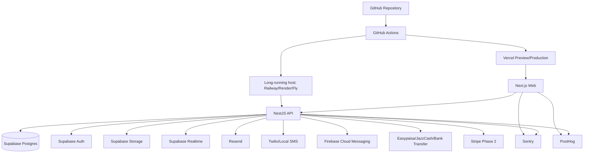

# Setup.md

## Setup Guide

This document defines local development, deployment, CI/CD, environment management, backup, and disaster recovery for the marketplace.

## Target Stack

- Frontend: Next.js App Router, React, TypeScript, Tailwind CSS.
- State: React Query and Zustand.
- Backend: NestJS on Node.js LTS.
- Database/Auth/Storage/Realtime: Supabase.
- Deployment: `web` on Vercel; `api` on a long-running host (see [API Hosting Decision](#api-hosting-decision)).
- Observability: Sentry, PostHog, Vercel Analytics.
- Notifications: Resend, SMS provider, Firebase Cloud Messaging.
- Payments: Easypaisa, JazzCash, bank transfer for Pakistan; Stripe for USA Phase 2.

## Local Development

Recommended commands after implementation exists:

```bash
pnpm install
pnpm lint
pnpm typecheck
pnpm test
pnpm dev
```

Supabase local workflow:

```bash
supabase start
supabase db reset
supabase migration new <name>
supabase db diff
```

## Environment Strategy

Use three environments.

| Environment | Purpose                      | Data                       |
| ----------- | ---------------------------- | -------------------------- |
| Development | Local and individual testing | Local or disposable data   |
| Staging     | Pre-production validation    | Sanitized test data        |
| Production  | Live marketplace             | Real user and payment data |

## Environment Variables

### Web

```text
NEXT_PUBLIC_APP_URL=
NEXT_PUBLIC_SUPABASE_URL=
NEXT_PUBLIC_SUPABASE_ANON_KEY=
NEXT_PUBLIC_POSTHOG_KEY=
NEXT_PUBLIC_POSTHOG_HOST=
NEXT_PUBLIC_SENTRY_DSN=
NEXT_PUBLIC_DEFAULT_REGION=PK
NEXT_PUBLIC_DEFAULT_LOCALE=en
```

### API

```text
NODE_ENV=
API_BASE_URL=
SUPABASE_URL=
SUPABASE_ANON_KEY=
SUPABASE_SERVICE_ROLE_KEY=
DATABASE_URL=
JWT_AUDIENCE=
JWT_ISSUER=
RESEND_API_KEY=
SMS_PROVIDER=
TWILIO_ACCOUNT_SID=
TWILIO_AUTH_TOKEN=
TWILIO_FROM_NUMBER=
FCM_SERVER_KEY=
EASYPAISA_MERCHANT_ID=
EASYPAISA_API_KEY=
JAZZCASH_MERCHANT_ID=
JAZZCASH_PASSWORD=
JAZZCASH_INTEGRITY_SALT=
STRIPE_SECRET_KEY=
STRIPE_WEBHOOK_SECRET=
SENTRY_DSN=
POSTHOG_API_KEY=
PAYMENT_WEBHOOK_SECRET=
```

## API Hosting Decision

Resolved in M0 (DEVOPS-02). The open question from `ImplementationPlan.md` ("Vercel for API where feasible") is decided as follows:

| Component       | Host                                              | Rationale                                                                     |
| --------------- | ------------------------------------------------- | ----------------------------------------------------------------------------- |
| `web` (Next.js) | **Vercel**                                        | First-class Next.js support, edge/CDN, preview deployments per PR.            |
| `api` (NestJS)  | **Long-running host** (Railway / Render / Fly.io) | A persistent Node process is required; serverless is unsuitable for this API. |

Why the API is not on Vercel serverless:

- **Payment webhooks** (Easypaisa/JazzCash/Stripe) need reliable, signature-verified handling without cold-start latency or execution-time caps.
- **Transactional outbox drainer** (M1) is a scheduled, long-running worker; serverless function timeouts and lack of background execution make it brittle.
- **Connection pooling** to Supabase Postgres is stable from a long-lived process; serverless invocations exhaust connections without an external pooler.

Implications:

- The Supabase **service-role key** lives only in the API host's secret manager, never in the web/Vercel environment.
- Webhook endpoints (`POST /api/v1/payments/:provider/webhook`) and the outbox drainer run on the long-running host; Vercel proxies user traffic to the API via `NEXT_PUBLIC_API_URL`.
- Confirm the chosen host supports a scheduled task/cron (or a always-on worker) for the outbox drainer before M5.

## Infrastructure Diagram



## CI/CD Pipeline

GitHub Actions should run:

1. Install dependencies.
2. Lint.
3. Typecheck.
4. Unit tests.
5. Integration tests where available.
6. Build web.
7. Build API.
8. Validate database migrations.
9. Generate or validate OpenAPI.

Example workflow:

```yaml
name: ci

on:
  pull_request:
  push:
    branches: [main]

jobs:
  checks:
    runs-on: ubuntu-latest
    steps:
      - uses: actions/checkout@v4
      - uses: pnpm/action-setup@v4
      - uses: actions/setup-node@v4
        with:
          node-version: 22
          cache: pnpm
      - run: pnpm install --frozen-lockfile
      - run: pnpm lint
      - run: pnpm typecheck
      - run: pnpm test
      - run: pnpm build
```

## Deployment Workflow

### Preview

- Every pull request deploys to Vercel Preview.
- Preview uses staging Supabase or isolated preview data.
- Payment providers must use sandbox credentials.

### Staging

- Main branch deploys to staging first.
- Run migrations against staging.
- Run smoke tests:
  - Auth.
  - Animal creation.
  - Listing search.
  - Breeding request.
  - Payment intent sandbox.
  - Notification sandbox.

### Production

- Production deployment requires:
  - Passing CI.
  - Migration reviewed.
  - Rollback plan.
  - No open critical Sentry issues.

## Database Migration Strategy

- Migrations are version-controlled.
- Use backward-compatible migrations when possible.
- For destructive changes:
  - Add new column/table.
  - Backfill.
  - Switch reads/writes.
  - Drop old structure in a later release.
- Never manually edit production schema outside migration process except incident response.

## Backup Strategy

### Supabase PostgreSQL

- Enable automated daily backups.
- For production, use point-in-time recovery if available on selected plan.
- Export schema and critical seed configuration after major releases.
- Test restore into staging at least once before launch and after major schema changes.

### Supabase Storage

- Keep original media and documents.
- Use lifecycle policies only after legal and business retention requirements are defined.
- For private documents, preserve metadata linking file path to business record.

### Application Config

- Store non-secret region/compliance configuration in database.
- Store secrets in Vercel/Supabase environment variable managers.
- Keep an encrypted offline copy of provider account recovery details with founders/operators.

## Disaster Recovery Plan

### Incident Classes

| Incident                   | Recovery Objective                  | Response                                  |
| -------------------------- | ----------------------------------- | ----------------------------------------- |
| Frontend deploy failure    | Restore previous Vercel deployment  | Rollback in Vercel                        |
| API deploy failure         | Restore previous deployment         | Rollback and disable failing feature flag |
| Database migration failure | Restore backup or apply forward fix | Use migration rollback plan               |
| Payment webhook failure    | Prevent duplicate handling          | Replay provider events idempotently       |
| Storage access issue       | Preserve records                    | Disable uploads, keep reads signed        |
| Data breach                | Contain and notify                  | Rotate keys, audit access, legal response |

### Recovery Priorities

1. Protect user data and payment records.
2. Prevent duplicate payments/refunds.
3. Restore auth and read access.
4. Restore request and payment workflows.
5. Restore non-critical analytics and promotions.

## Observability

### Logs

- API request logs.
- Auth failure logs.
- Payment webhook logs.
- Admin action logs.
- RLS/service role usage logs.

### Metrics

- API 4xx/5xx rate.
- Payment webhook success/failure.
- Search latency.
- Database query latency.
- Upload failures.
- Notification delivery failures.

### Alerts

- Payment webhook failures.
- High API error rate.
- Database connection saturation.
- Authentication outage.
- Storage upload outage.
- Suspicious admin activity.

## Security Checklist

- RLS enabled.
- Service role isolated to server.
- JWT validation enabled.
- Rate limits configured.
- CORS restricted.
- Webhook signatures verified.
- Signed URL expiration configured.
- Sentry PII scrubbing enabled.
- PostHog privacy filters enabled.
- Admin routes protected by RBAC.

## MVP Operational Cost Planning

Expected managed infrastructure cost for low-volume MVP: USD 165-2,549 per month depending on SMS, analytics, database tier, and traffic.

Primary cost drivers:

- SMS/OTP.
- Storage and video uploads.
- Database plan.
- Marketing traffic.
- Verification operations.

## Checkpoint

Before production launch, complete a restore test, payment webhook replay test, RLS review, and smoke test of the full breeding request workflow.
