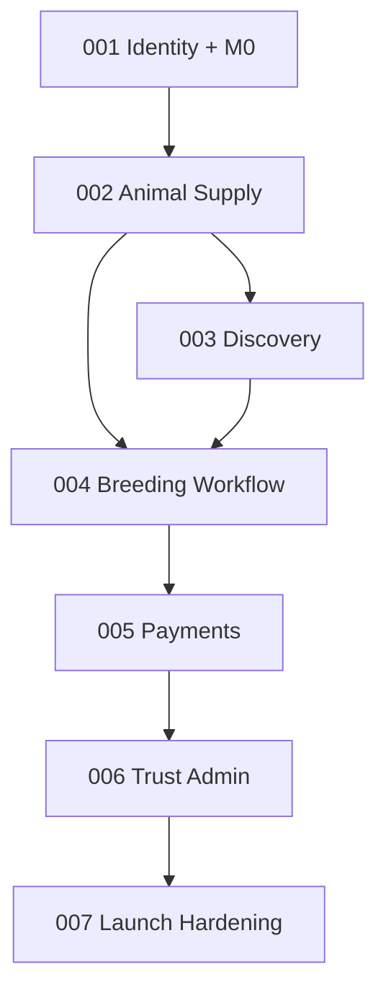

# Module → Spec Kit Roadmap

**Last updated**: 2026-06-30

Tracks Spec Kit artifacts for the full MVP (M1–M7). Status legend: ⬜ not started · 📝
spec draft · ✅ spec+plan · 🔧 tasks · 🚀 implementing · ✔ done

| Spec ID | Feature branch | Milestone | Modules covered | Spec | Plan | Research | Tasks | Implement |
| --- | --- | --- | --- | --- | --- | --- | --- | --- |
| `000` | `000-product-scope` | — | Master scope | ✅ | — | — | — | — |
| `001` | `001-identity-auth` | M1 (+ M0 inline) | `system`, `config/regions`, `identity`, `users`, `audit`, `analytics`, `notifications`, `breeds`, outbox | ✅ amended | ✅ amended | ✅ amended | ✅ | ⬜ |
| `002` | `002-animal-supply` | M2 | `animals`, `health`, `pedigree`, `verification` (badges) | ✅ | ✅ | ✅ | ✅ | ⬜ |
| `003` | `003-discovery` | M3 | `marketplace`, `matching` | ✅ | ✅ | ✅ | ✅ | ⬜ |
| `004` | `004-breeding-workflow` | M4 | `breeding-requests`, `messaging` | ✅ | ✅ | ✅ | ✅ | ⬜ |
| `005` | `005-payments-trust` | M5 | `payments`, `wallet-ledger` | ✅ | ✅ | ✅ | ✅ | ⬜ |
| `006` | `006-trust-admin` | M6 | `verification` (workflow), `reviews`, `admin` | ✅ | ✅ | ✅ | ✅ | ⬜ |
| `007` | `007-launch-hardening` | M7 | Cross-cutting hardening, retention, DR, perf | ✅ | ✅ | ✅ | ✅ | ⬜ |

## Dependency graph (implementation order)

## Per-spec next actions

### 001–007 — tasks complete

All features have `tasks.md`. Next: `/speckit-implement` starting at `001-identity-auth`.

## Suggested spec inputs (one-liners for `/speckit-specify`)

| ID | Suggested `$ARGUMENTS` |
| --- | --- |
| `002` | Animal supply: CRUD animals with media, health records, pedigree, breeder profiles, listing drafts, default unverified badges (M2) |
| `003` | Discovery: publish listings, PostgreSQL search/filters, listing detail, SEO city/species pages, saved listings, discovery analytics (M3) |
| `004` | Breeding workflow: canonical request lifecycle, events, breeding records, messaging with phone masking, workflow notifications (M4) |
| `005` | Payments & trust: payment intents, bank-transfer proof, Easypaisa/JazzCash/Stripe stubs, immutable ledger, protected-payment states, boosts/subscriptions stubs (M5) |
| `006` | Trust & admin: vet/inspector verification queues, disputes, reviews/reputation, moderation, audit explorer, admin dashboards (M6) |
| `007` | Launch hardening: RBAC/state-transition coverage, security review, performance, observability, DR/webhook replay, retention policy, beta instrumentation (M7) |
